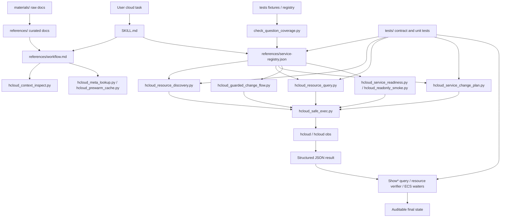
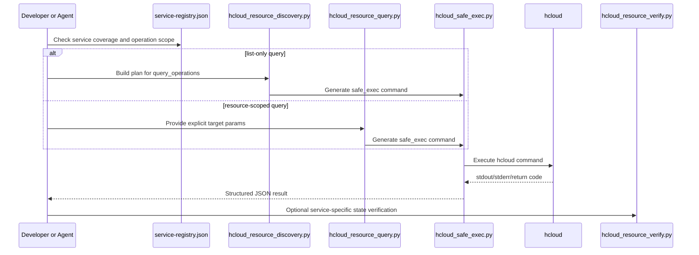
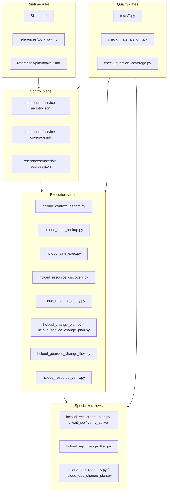

# Architecture

`huaweicloud-skill` 是一个基于华为云 KooCLI (`hcloud`) 的执行型 skill。它的目标不是让模型记住所有云命令，而是把云资源操作拆成一条可审计、可验证、可扩展的执行链路。

核心链路是：

1. 检查本机 `hcloud` 上下文。
2. 发现 service、operation 和参数线索。
3. 根据机器可读 registry 生成命令或变更计划。
4. 通过统一包装器执行命令。
5. 对返回结果做结构化错误诊断、资源状态验证和后续检查。

v0.2 的架构重点是四个平面：

- **控制面**：`references/service-registry.json` 决定服务、operation、runner、planner、verifier 和 known limits。
- **执行面**：`hcloud_safe_exec.py` 统一执行、脱敏、JSON 解析和错误诊断。
- **验证面**：job waiter、resource query、resource verifier、service readiness 分层确认结果。
- **回归面**：单测、架构契约、materials drift 和 coverage 检查持续约束实现。

## 顶层结构

```text
huaweicloud-skill/
├── SKILL.md
├── README.md
├── references/
├── scripts/
├── examples/
├── materials/
├── tests/
└── docs/
```

各目录职责：

| 路径 | 职责 |
| --- | --- |
| `SKILL.md` | 面向 agent 的入口，定义触发场景、质量规则和默认工作流。 |
| `references/` | 清洗后的操作资料，包括 workflow、playbook、错误手册、服务覆盖矩阵和 service registry。 |
| `scripts/` | 可执行 Python 脚本，负责上下文探查、命令生成、安全执行、规划、验证和 coverage 检查。 |
| `examples/` | 可复用的输入模板和示例，例如 ECS 创建 JSON。 |
| `materials/` | 原始 KooCLI 文档材料，只作为资料源，不直接作为运行时规则。 |
| `tests/` | 单测、架构契约测试和人工验证记录。 |
| `docs/` | 当前目录，面向开发者解释架构和实现。 |

## 架构总览



## 设计原则

### 1. 发现优先，不靠记忆

华为云服务和 KooCLI operation 很多，参数形态也会变化。skill 的设计不是硬编码所有命令，而是按顺序使用：

1. `references/service-registry.json`
2. 本地 `~/.hcloud/metaRepo`
3. `hcloud <service> --help`
4. `hcloud <service> <operation> --help`
5. `references/` 和 `materials/`

这样可以减少模型猜参数造成的错误。

### 2. 查询和变更分流

查询类脚本默认生成 JSON 友好的 read-only 命令，例如：

- `hcloud_resource_discovery.py`
- `hcloud_resource_query.py`
- `hcloud_readonly_smoke.py`
- `hcloud_service_readiness.py`

变更类脚本默认只生成计划或 dry-run 命令，例如：

- `hcloud_change_plan.py`
- `hcloud_service_change_plan.py`
- `hcloud_ecs_create_plan.py`
- `hcloud_eip_change_flow.py`
- `hcloud_guarded_change_flow.py`
- `hcloud_obs_change_plan.py`

真实 submit 需要显式确认，尤其是创建、绑定、扩容、删除、停用、证书变更等可能产生费用或影响可用性的操作。通用 guarded flow 会把 planner 输出进一步包成 dry-run、submit 确认门禁、资源级 Show* 后置验证和服务级 read-only smoke。

### 3. 所有执行都尽量经由 safe exec

`hcloud_safe_exec.py` 是统一执行包装器。它负责：

- 构造 `hcloud` 子进程命令。
- 收集并脱敏本地 profile、命令参数和 JSON 输入中的敏感值。
- 解析 JSON 输出。
- 识别 KooCLI 错误类型。
- 生成结构化 `error_details`。
- 控制超时和输出长度。

上层脚本尽量输出 `python3 scripts/hcloud_safe_exec.py ...`，而不是直接输出裸 `hcloud ...`。

### 4. 机器可读 registry 是服务覆盖控制面

`references/service-registry.json` 是多服务能力的中心索引。它说明每个服务：

- 覆盖等级。
- 是否需要 region。
- 哪些 operation 可作为通用 list/query 起点。
- 哪些 operation 必须显式传资源 ID。
- 哪些 change operation 只允许 planner-only。
- 是否有专用 runner。
- 已知限制和 playbook。

通用脚本通过 registry 决定如何构造命令，而不是在脚本里散落大量服务判断。

## 执行链路

### 查询类链路



`query_operations` 和 `resource_query_operations` 的边界很重要：

- `query_operations` 是通用发现入口，例如 `ListVpcs`、`ListInstances`、`ListPublicips`。
- `resource_query_operations` 必须有目标上下文，例如 `ShowVpc`、`ShowPublicip`、`ShowLoadBalancer`。

脚本不会替用户猜资源 ID。缺少显式目标参数时，`hcloud_resource_query.py` 会失败并返回 `missing_params`。

### 变更类链路


目前具备三类变更闭环：

- ECS：创建 JSON 本地校验、dry-run、submit 命令生成、`ShowJob` 轮询、`ACTIVE` 验证。
- EIP：Plan -> dry-run -> guarded submit -> `ShowPublicip` verify 的参考 flow。
- VPC / ELB / EVS / NAT / RDS / CDN / DNS / SCM：通用 Plan -> dry-run -> guarded submit -> resource Show* verify -> read-only smoke 的 P0 门禁。
- OBS：obsutil planner-only 变更计划和后置只读验证计划。

这些闭环不表示可以无确认自动 submit。它们的价值是把真实写操作前后的风险边界、命令链和验证链结构化，复杂业务语义仍需要服务专用 verifier 继续增强。

## 模块分层



## 服务覆盖等级

覆盖等级不是华为云服务成熟度，而是本 skill 内部自动化能力的成熟度。

| 等级 | 含义 |
| --- | --- |
| `high` | 有较完整的 planner、playbook、验证器和实际验证路径。当前主要是 ECS。 |
| `medium` | 有稳定查询、readiness 或专项 guarded flow，但复杂业务语义验证仍不完整。 |
| `low` | 有最小查询入口、资源级查询或通用 guarded change 线索，仍依赖显式参数、账号权限和后续人工确认。 |

维护者扩展服务时，应先补 read-only 查询和验证，再补 planner-only 变更，最后再考虑 guarded submit。

当前 registry 覆盖 16 个服务、146 个 `query_operations`、61 个 `resource_query_operations` 和 80 个 `change_operations`。这些数字不是服务成熟度承诺，而是当前自动化控制面的机器可读范围。

## OBS 的特殊性

OBS 不是普通的 `hcloud <Service> <Operation>` 形态。它走 KooCLI 集成的 obsutil：

```text
hcloud obs <command> ...
```

所以 OBS 在 registry 中配置了专用 runner：

- `scripts/hcloud_obs_readonly.py`
- `scripts/hcloud_obs_change_plan.py`

通用 `hcloud_resource_discovery.py` 和 `hcloud_resource_query.py` 会拒绝普通 OBS 查询，避免生成错误的 `hcloud OBS Operation` 命令。

## 关键不变量

开发时需要保持以下不变量：

- 查询类默认 JSON 输出：`--cli-output=json` 和 `--expect-json`。
- 变更类默认 plan/dry-run，不默认 submit。
- 资源级查询必须显式传目标参数。
- 通用 guarded flow 缺少目标 ID 时必须返回 `missing_params`，不得猜测资源。
- 异步 job 成功不等于资源可用，必须继续做资源状态验证。
- 敏感读取默认阻断，例如密码、私钥、token。
- registry 中配置的 runner、planner、playbook 路径必须存在或有明确 known limit。
- docs、references、tests 和 registry 要保持同步。
