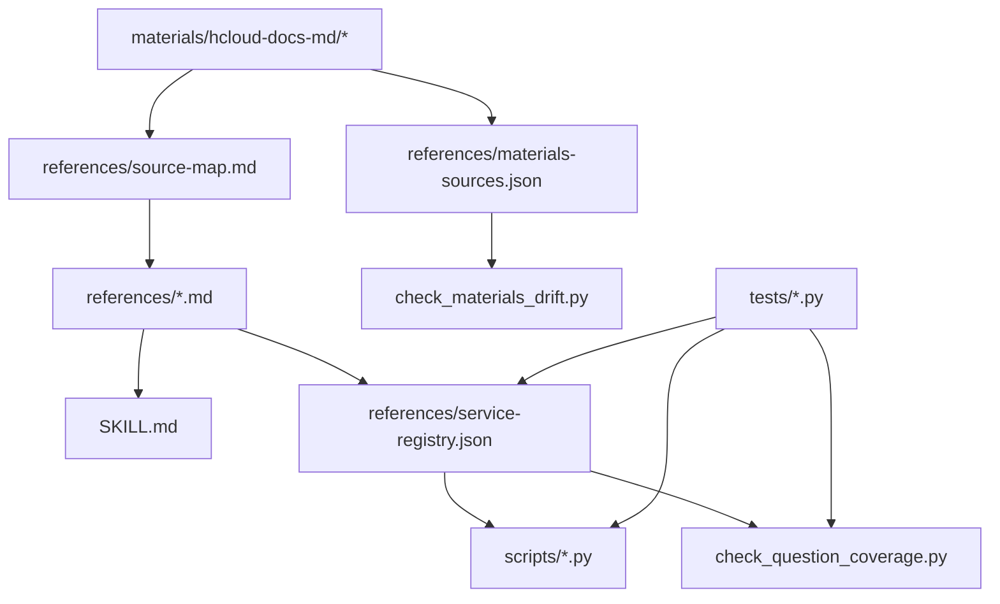

# Data and Coverage

`huaweicloud-skill` 的能力不是只靠代码，还依赖几类仓库内数据资产：清洗后的 references、原始 materials、机器可读 service registry 和测试记录。本文解释这些数据如何组织，以及它们如何约束实现。

## 数据分层



## `references/`

`references/` 是清洗后的运行时资料层。相比 `materials/`，它更稳定、更短，也更贴近 skill 的实际行为。

关键文件：

| 文件 | 用途 |
| --- | --- |
| `workflow.md` | 标准执行流程，从意图分类到上下文、发现、执行、验证。 |
| `auth-and-context.md` | hcloud 认证、profile、region、project 等上下文规则。 |
| `command-construction.md` | 命令构造规则，包括 JSON 输出、`--cli-jsonInput`、`--dryrun`。 |
| `error-playbook.md` | 常见 KooCLI 错误处理策略。 |
| `output-and-query.md` | 输出格式、查询和空响应处理规则。 |
| `cache-prewarm.md` | metadata/help cache 预热说明。 |
| `local-meta-discovery.md` | 本地 meta cache 结构和发现方式。 |
| `service-coverage.md` | 人类可读服务覆盖矩阵。 |
| `service-registry.json` | 机器可读服务覆盖和路由控制面。 |
| `playbooks/` | 面向具体任务的执行手册。 |

开发时，优先更新 `service-registry.json` 和相关 tests，再更新人类文档。

## `materials/`

`materials/` 保存原始 KooCLI 文档转换结果。它不是运行时规则，只是资料源。

当前主要来源包括：

- KooCLI 用户指南。
- KooCLI 常见问题。
- KooCLI 快速入门。
- KooCLI 产品介绍。
- KooCLI 最新动态。

原始材料存在目录噪声、页码残留、图片占位、命令换行断裂等问题。因此开发时应：

1. 优先读 `references/`。
2. `references/` 没覆盖时再回到 `materials/`。
3. 从 `materials/` 抽取新规则后，沉淀到 `references/`。
4. 维护 `references/materials-sources.json` 的映射。

## Materials drift check

`scripts/check_materials_drift.py` 检查 `references/materials-sources.json` 中声明的 reference 和 material 文件是否存在，以及 material 是否比 reference 更新。

输出中每条 finding 有：

- `reference`
- `materials`
- `missing`
- `newer_materials`
- `status`

如果原始材料比清洗后的 reference 更新，说明 reference 可能需要重新检查。

## Service registry

`references/service-registry.json` 是最重要的数据文件。它驱动通用 discovery、resource query、service readiness、smoke、planner 和 coverage 检查。

当前 v0.2 registry 摘要：

| 指标 | 数量 |
| --- | --- |
| 服务 | 16 |
| `query_operations` | 146 |
| `resource_query_operations` | 61 |
| `change_operations` | 80 |

这些数字的含义是“skill 已经能识别、规划或生成对应执行路径”，不是“所有 operation 都可以无确认真实提交”。写类 operation 仍受 planner、dry-run、显式确认和后置验证约束。

### 顶层结构

```json
{
  "version": 1,
  "services": {
    "ECS": {
      "coverage": "high",
      "default_region_required": true,
      "query_operations": [],
      "resource_query_operations": [],
      "change_operations": [],
      "planner": "scripts/hcloud_ecs_create_plan.py",
      "job_verifier": "scripts/hcloud_ecs_wait_job.py",
      "resource_verifier": "scripts/hcloud_ecs_verify_active.py",
      "playbooks": [],
      "official_docs": [],
      "known_limits": []
    }
  }
}
```

### 常用字段

| 字段 | 含义 |
| --- | --- |
| `coverage` | skill 内部覆盖等级：`high`、`medium`、`low`。 |
| `default_region_required` | 默认是否需要 region。 |
| `supported_cli_regions` | 某些服务的 KooCLI 可接受 region 白名单，例如 CDN。 |
| `preferred_cli_region` | 当请求 region 不支持时的默认替代 region。 |
| `query_runner` | list-only 查询专用 runner。缺省是 `scripts/hcloud_resource_discovery.py`。 |
| `resource_query_runner` | 资源级查询专用 runner。缺省是 `scripts/hcloud_resource_query.py`。 |
| `query_operations` | 可作为通用发现入口的 read-only operation。 |
| `resource_query_operations` | 需要目标资源 ID 或上下文的 read-only operation。 |
| `change_operations` | 已纳入 planner-only 或专用 flow 的变更 operation。 |
| `planner` | 变更规划脚本。 |
| `job_verifier` | 异步 job 验证脚本。 |
| `resource_verifier` | 资源状态验证脚本。 |
| `playbooks` | 对应服务或场景的参考手册。 |
| `known_limits` | 当前实现边界和已知限制。 |

### Operation 分类

`query_operations` 和 `resource_query_operations` 的区别是扩展服务时最容易出错的地方。

`query_operations` 应满足：

- 没有资源 ID 也能执行。
- 适合做服务现状发现。
- 常见形式是 `List*`、`Count*`、部分 `ShowQuota*`。

`resource_query_operations` 应满足：

- 需要明确资源 ID、name 或父资源 ID。
- 不适合通用 smoke 自动执行。
- 常见形式是 `Show*` 或资源作用域下的 `List*`，例如 ELB `ListMembers` 需要 `pool_id`。

`change_operations` 表示“可以被 planner 识别”，不等于“可以自动执行真实变更”。除非有专门 flow 和确认门禁，否则默认 planner-only。

当前已有两类 change flow：

- EIP 专用 flow：`scripts/hcloud_eip_change_flow.py`，Plan -> dry-run -> guarded submit -> `ShowPublicip` verify。
- 多服务通用 flow：`scripts/hcloud_guarded_change_flow.py`，覆盖 VPC、ELB、EVS、NAT、RDS、CDN、DNS、SCM，Plan -> dry-run -> guarded submit -> resource Show* verify -> read-only smoke。

## Coverage gate

`scripts/check_question_coverage.py` 是 registry 覆盖和风险分类的质量门禁入口。开发者只需要理解它在本仓库中的作用：

- 复用 `hcloud_change_plan.assess_risk()` 检查风险分类规则。
- 检查 service registry 中的 operation 是否能映射到查询、资源查询、planner 或 guarded flow。
- 检查 operation alias 是否能映射到真实 KooCLI operation，例如 RDS 配置详情查询映射到 `ShowConfiguration`。
- 对架构契约测试提供 fixture 级别的安全回归能力。

扩展 registry 或风险判断时，应同步更新该脚本和相关契约测试，确保 coverage 和安全边界没有退化。

## 测试体系

### 单元测试

`tests/test_hcloud_safe_exec.py`、`tests/test_hcloud_meta_lookup.py`、`tests/test_hcloud_ecs_create_plan.py` 等文件覆盖单个脚本的核心逻辑。

### 多服务工具测试

`tests/test_hcloud_multiservice_tools.py` 覆盖：

- smoke plan。
- OBS runner 路由。
- resource query 参数校验。
- EIP guarded flow。
- 多服务通用 guarded flow 的资源级 Show* 后置验证、缺参、submit 结果 ID 提取和显式 verify operation。
- OBS planner-only。
- service readiness。
- resource verifier。
- CDN region resolution。
- service change plan 约束。

这些测试不调用真实 `hcloud`，主要验证输出契约和路由逻辑。

### 架构契约测试

`tests/test_hcloud_architecture_contracts.py` 约束更高层的不变量：

- registry 中 high coverage 服务必须有 playbook、planner、resource verifier。
- registry 中 playbook 路径必须存在。
- discovery 命令必须 JSON-friendly。
- resource-scoped query 不得误作为 generic discovery。
- 风险分类必须符合预期。
- materials mapping 必须 well formed。
- coverage 检查必须能识别安全 fixture。

开发者修改 registry 或风险判断时，应优先看这个测试文件。

## 当前覆盖摘要

当前覆盖状态可以理解为三层：

| 层级 | 服务 | 当前能力 |
| --- | --- | --- |
| 完整闭环 | ECS | 查询、创建 JSON 校验、dry-run/submit 命令生成、job 轮询、ACTIVE 验证。 |
| 重点增强 | VPC、IMS、KPS、EIP、RDS、EVS、ELB、NAT、IAM | 多数有 list/readiness 路径；部分有资源级查询；EIP 有专用 guarded flow；VPC/ELB/EVS/NAT/RDS 已接入通用 guarded flow。 |
| 最小路径 | CCE、CDN、DNS、SCM、OBS、CES | 有最小查询入口或专用适配；CDN/DNS/SCM 已接入通用 guarded flow；OBS 有专用 obsutil planner-only。 |

OBS 是特殊服务，不通过普通 OpenAPI-style metadata，而通过 `hcloud obs`/obsutil 适配。

## 当前验证摘要

v0.2 发布前的主要回归结果：

| 验证项 | 结果 |
| --- | --- |
| 单元测试 | 94 个测试通过 |
| registry JSON | `python3 -m json.tool references/service-registry.json` 通过 |
| materials drift | `check_materials_drift.py` 通过 |
| coverage check | `check_question_coverage.py` 通过 |
| guarded flow 矩阵 | VPC / ELB / EVS / NAT / RDS / CDN / DNS / SCM 均能生成资源级 Show* 后置验证计划 |

这组验证说明项目不是只写了文档和脚本，而是把覆盖、风险和执行路径纳入了可重复检查的质量门禁。

## 新增或提升覆盖时的 checklist

扩展 `service-registry.json` 时，建议检查：

- 新 service 是否有正确 `coverage`。
- list 型 operation 是否放入 `query_operations`。
- 需要资源 ID 的 operation 是否放入 `resource_query_operations`。
- change operation 是否有 planner 或 known limit。
- change operation 是否需要接入通用 guarded flow 或专用 flow。
- 后置验证能否安全映射到 Show* operation；如果能，是否补齐 required params。
- 有专用命令形态时是否配置 `query_runner` 或 `resource_query_runner`。
- playbook 路径是否存在。
- `known_limits` 是否诚实描述当前边界。

扩展脚本时，建议检查：

- 是否默认 JSON 输出。
- 是否经过 `hcloud_safe_exec.py`。
- 是否对敏感读取做门禁。
- 是否避免猜测资源 ID。
- 是否能输出机器可读失败原因。
- 是否有单测覆盖 plan 模式，不依赖真实云账号。

扩展 coverage 门禁时，建议检查：

- operation alias 是否必要。
- operation 归一化是否会误判服务或资源名。
- coverage ratio 是否合理，避免把低价值 operation 大量塞进 registry。

## 推荐验证命令

完整本地回归：

```bash
python3 -m unittest discover tests
python3 scripts/check_materials_drift.py --pretty
```

只验证 registry 和多服务脚本契约时：

```bash
python3 -m unittest tests.test_hcloud_architecture_contracts tests.test_hcloud_multiservice_tools
```

只改文档时：

```bash
git diff --check
```
