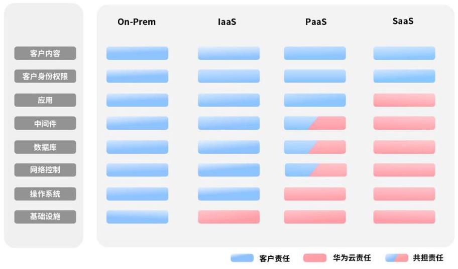
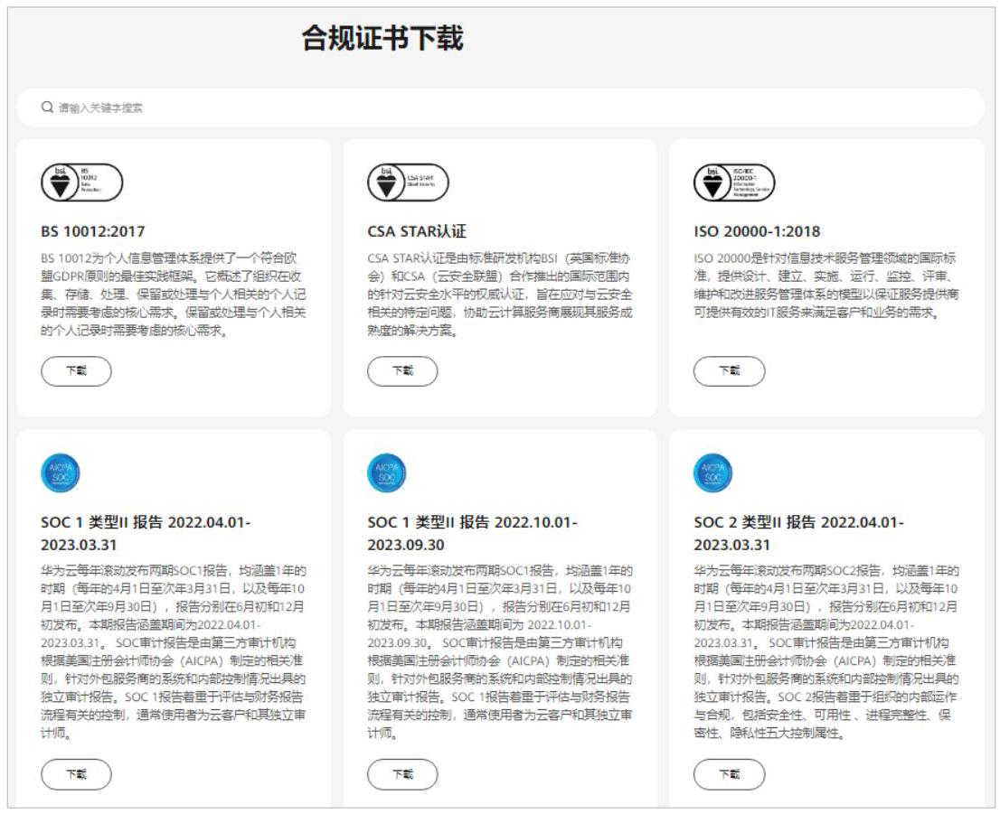
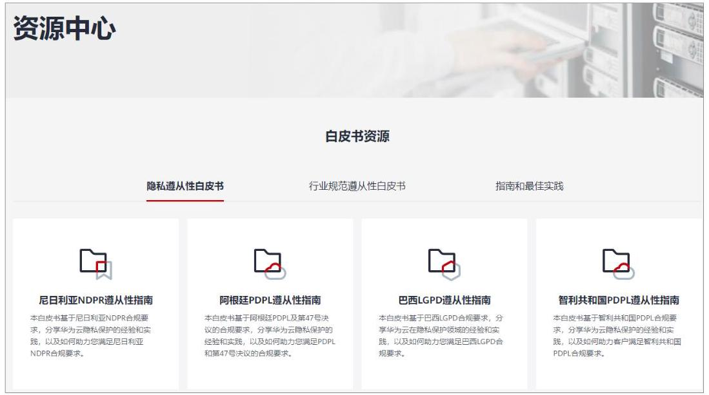
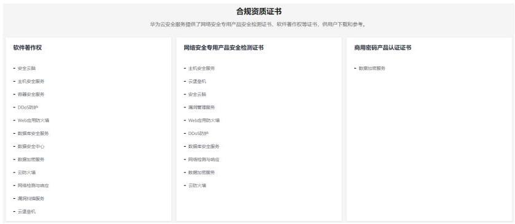

# 华为云命令行工具服务 产品介绍

文档版本 01

发布日期 2026-04-10

32

## 版权所有 (C) 华为云计算技术有限公司 2026。保留一切权利。

非经本公司书面许可，任何单位和个人不得擅自摘抄、复制本文档内容的部分或全部，并不得以任何形式传播。

## 商标声明

HUAWE 和其他华为商标均为华为技术有限公司的商标。

本文档提及的其他所有商标或注册商标，由各自的所有人拥有。

## 注意

您购买的产品、服务或特性等应受华为云计算技术有限公司商业合同和条款的约束，本文档中描述的全部或部分产品、服务或特性可能不在您的购买或使用范围之内。除非合同另有约定，华为云计算技术有限公司对本文档内容不做任何明示或暗示的声明或保证。

由于产品版本升级或其他原因，本文档内容会不定期进行更新。除非另有约定，本文档仅作为使用指导，本文档中的所有陈述、信息和建议不构成任何明示或暗示的担保。

## 华为云计算技术有限公司

地址: 贵州省贵安新区黔中大道交兴功路华为云数据中心 邮编:55002

网址: https://www.huaweicloud.com/

## 目录

1 隐私声明

.1

2 什么是 KooCLI.

.2

3 KooCLI 相关概念

.3

4 如何使用 KooCLI

5

5 安全.

.6

5.1 责任共担

.6

5.2 身份认证与访问控制

.7

5.3 数据保护技术

.8

5.4 审计与日志.

.8

5.5 更新管理.

.8

5.6 认证证书.

..9

5.7 风险防范.

10

详见《隐私政策声明》。

KooCLI的3.2.8及以后的版本在首次使用时，请您根据交互提示信息，选择是否同意其互联网连接及隐私政策声明。

对于不方便交互的场景，如以自动化脚本执行KooCLI命令，可通过如下命令，配置同意隐私声明:

hcloud configure set --cli-agree-privacy-statement=true

华为云命令行工具服务(Koo Command Line Interface，KooCLI，原名HCloud CLI) 是为发布在API Explorer上的云服务API提供的命令行管理工具。您可以通过此工具调用API Explorer中各云服务开放的API，管理和使用您的各类云服务资源。

KooCLI只提供了一种通过CLI调用云服务API的方法。在使用KooCLI之前，您需要熟悉该API。KooCLI无法为您提供云服务API的具体使用方面的专业帮助，相关问题请咨询服务oncall。

在使用KooCLI之前，您可以使用API Explorer平台查找所需的API、查看在线文档。

KooCLI灵活性高且易于扩展:

- 单一可执行文件，绿色免安装，下载解压后即可使用。

- 多操作系统支持，包括Linux、Windows、Mac。

- 扩展性强，您可基于此工具对云服务API进行封装，扩展出您想要的功能，实现脚本化管理云服务资源。

☐ 说明

下载KooCLI，请参考《快速入门》。

须知

在Windows系统使用KooCLI时，请勿双击执行hcloud.exe文件，正确的用法是在 hcloud.exe文件所在目录下打开命令行工具(支持CMD、PowerShell)后执行相应命令。

在KooCLI指导中常用到的词语，以下做出详细介绍，方便您的阅读理解。

- 命令

KooCLI提供的各项操作指令，用于配置工作环境，或者调用云各服务开放的API。 API调用命令格式如下:

hcloud [options] <service> <operation> [--param1=param1=paramValue1 -- param2=paramValue2 ...]

系统命令格式如下:

hcloud [options] <systemCommand> <operation> [-- param1=paramValue1 --param2=paramValue2 ...]

在如下“查询云服务器信息列表”的命令中，service为“ECS”，operation为 “NovaListServers”，调用API所需的公共信息从名为“default”的配置项中获取:

hcloud ECS NovaListServers --cli-profile=default

- operation

operation是指云服务在API Explorer上发布的API的英文名称，可唯一表达某 API。云服务的operation列表可从API Explorer上查询，或执行 “hcloud <service> --help”命令获取。

- 配置项

配置项用于存储一组调用云服务API时所需的公共信息，由用户通过调用KooCLI命令完成配置。各配置项组成配置文件，存储在用户本地。用户在调用云服务API 时，可通过指定配置项，代替这组公共信息的输入。

配置项支持配置的公共信息包括:访问密钥(AK/SK)、区域(cli-region)、项目ID(cli-project-id)、账号ID(cli-domain-id)等。

- 默认配置项

当命令中未指定配置项时，默认使用的配置项。KooCLI默认将最后一次添加或修改的配置项作为默认配置项；若默认配置项被删除，将剩余配置项中最早被添加的配置项作为新的默认配置项。用户可以使用 “hcloud configure set --cli-profile=\$\{profileName\}” 命令切换默认配置项。

- 参数

参数可分为API参数和KooCLI系统参数。API参数是指云服务的API中定义的参数； 系统参数是指KooCLI的内置参数，具有其固定的使用方式和特定含义。请查看系统参数列表。

- 选项

KooCLI选项是指可以直接在调用API的命令中添加的KooCLI系统参数，并非所有的系统参数都可作为选项使用。请查看选项列表。

- 元数据

KooCLI在命令执行过程中需要获取云服务及其API的详情信息，用于命令中参数的校验及解析，该数据称为元数据。远程获取的元数据会被保存在用户本地供后续使用，以减少命令执行过程中的网络IO，提高命令响应速度，保存元数据的文件称为元数据缓存文件。请查看如何管理元数据缓存文件。

KooCLI在使用离线模式时，会下载已有元数据的合集，称为离线元数据包。

步骤1 下载KooCLI。

KooCLI绿色免安装，下载到本地后解压即可使用。KooCLI支持Windows 64位、Linux AMD 64位、Linux ARM 64位、macOS AMD 64位、macOS ARM 64位，请根据您本地系统下载对应的版本。

步骤2 配置KooCLI环境。

环境配置请参考快速初始化配置。

步骤3 获取云服务API调用命令。

获取云服务API调用命令有两种方式:

- (推荐) API Explorer上获取

云服务的API可在API Explorer上查看。您可以在API Explorer上先填写好各参数的值，即可从 “CLI示例” 页签中直接获取命令。

- KooCLI帮助信息查询

具体查询方法可参考查看与执行云服务操作命令，Mac和Linux系统下查询方法类似。

步骤4 通过KooCLI调用云服务API。

输入完整的API调用命令后回车，即完成调用。

步骤5 (可选)将KooCLI命令集成到您的自定义脚本中，实现云服务资源的自动化管理。

---结束

### 5.1 责任共担

华为云秉承“将公司对网络和业务安全性保障的责任置于公司的商业利益之上”。针对层出不穷的云安全挑战和无孔不入的云安全威胁与攻击，华为云在遵从法律法规业界标准的基础上，以安全生态圈为护城河，依托华为独有的软硬件优势，构建面向不同区域和行业的完善云服务安全保障体系。

与传统的本地数据中心相比，云计算的运营方和使用方分离，提供了更好的灵活性和控制力，有效降低了客户的运营负担。正因如此，云的安全性无法由一方完全承担， 云安全工作需要华为云与您共同努力，如图5-1所示。

- 华为云:无论在任何云服务类别下，华为云都会承担基础设施的安全责任，包括安全性、合规性。该基础设施由华为云提供的物理数据中心(计算、存储、网络等)、虚拟化平台及云服务组成。在PaaS、SaaS场景下，华为云也会基于控制原则承担所提供服务或组件的安全配置、漏洞修复、安全防护和入侵检测等职责。

- 客户:无论在任何云服务类别下，客户数据资产的所有权和控制权都不会转移。 在未经授权的情况下，华为云承诺不触碰客户数据，客户的内容数据、身份和权限都需要客户自身看护，这包括确保云上内容的合法合规，使用安全的凭证(如强口令、多因子认证)并妥善管理，同时监控内容安全事件和账号异常行为并及时响应。

图 5-1 华为云安全责任共担模型

云安全责任基于控制权，以可见、可用作为前提。在客户上云的过程中，资产(例如设备、硬件、软件、介质、虚拟机、操作系统、数据等)由客户完全控制向客户与华为云共同控制转变，这也就意味着客户需要承担的责任取决于客户所选取的云服务。 如图5-1所示，客户可以基于自身的业务需求选择不同的云服务类别(例如IaaS、 PaaS、SaaS)。不同的云服务类别中，每个组件的控制权不同，这也导致了华为云与客户的责任关系不同。

- 在On-prem场景下，由于客户享有对硬件、软件和数据等资产的全部控制权，因此客户应当对所有组件的安全性负责。

- 在IaaS场景下，客户控制着除基础设施外的所有组件，因此客户需要做好除基础设施外的所有组件的安全工作，例如应用自身的合法合规性、开发设计安全，以及相关组件(如中间件、数据库和操作系统)的漏洞修复、配置安全、安全防护方案等。

- 在PaaS场景下，客户除了对自身部署的应用负责，也要做好PaaS服务中间件、数据库、网络控制的安全配置和策略工作。

- 在SaaS场景下，客户对客户内容、账号和权限具有控制权，客户需要做好自身内容的保护以及合法合规、账号和权限的配置和保护等。

传统本地部署(On-Prem):由客户在自有数据中心内部署和管理软件及IT基础设施， 而非依赖于远程的云服务提供商；

基础设施即服务(IaaS):由云服务提供商提供计算、网络、存储等基础设施服务，如弹性云服务器 ECS、虚拟专用网络 VPN、对象存储服务 OBS；

平台即服务(PaaS):由云服务提供商提供应用程序开发和部署所需要的平台，客户无需维护底层基础设施，如AI开发平台 ModelArts、云数据库 GaussDB；

软件即服务 (SaaS):由云服务提供商提供完整应用软件，客户直接应用软件而无需安装、维护应用软件及底层平台和基础设施，如华为云会议 Meeting。

### 5.2 身份认证与访问控制

KooCLI通过华为云API Gateway对华为云OpenAPI进行调用，其身份认证与访问控制与华为云OpenAPI保持一致。

## 身份认证

KooCLI的API调用分两种模式，一种是无身份认证的调用，当调用华为云OpenAPI中不需认证的API时用户不需要设置身份认证凭据即可调用；另一种是IAM认证后调用，当调用华为云OpenAPI中需要认证的API时用户需配置身份认证凭据后调用。

## 访问控制

- 对用户资源的访问控制

用户通过KooCLI对自己的资源进行调试及操作时和用户通过SDK操作华为云资源的访问权限是一致的，用户对华为云上某资源的访问控制权限和用户在相关服务里的权限保持一致。

- 对配置文件及运行日志的访问控制

KooCLI是运行在用户本地的一款客户端工具， KooCLI使用的相关配置文件及运行日志都保存在用户本地，此类文件的访问控制权限需要用户自己管控。

### 5.3 数据保护技术

## 加密传输(https)

KooCLI与华为云API Gateway之间的通信传输采用https协议，有效防止数据被篡改， 保护用户数据在网络中的传输安全。加密协议为业界公认安全性较高的TLS1.2、 TLS1.3。

## 敏感数据保护

用户使用KooCLI配置的认证凭据(如AK/SK)、自定义变量支持加密方式存储。 KooCLI的加密密钥在首次使用本工具时动态生成，以确保不同KooCLI客户端加密的密文无法互相解开，即只能解密自己加密的数据。

同时，当用户通过命令查询配置的敏感数据时，数据会以脱敏方式打印在屏幕上，以防止敏感信息泄露。

详情请见新增或修改配置项。

### 5.4 审计与日志

由于KooCLI是部署在用户本地的客户端工具，工具本身记录的日志可以作为审计目的使用，但是需要用户对日志进行访问权限控制以达到审计日志不可篡改的目的。此外， 同使用SDK一样，KooCLI将用户命令解析成https请求发送到API Gateway后， API Gateway记录的相关信息也可用作审计目的。

详情请见日志管理。

### 5.5 更新管理

## 开源第三方软件更新

KooCLI采用可信流水线构建，有完善的开源第三方软件管理流程，在每次版本发布时确保使用的开源第三方软件都是没有高危漏洞的。

## 高危漏洞修复

当业界公布最新的高危漏洞软件时， KooCLI如果涉及会发布修复后的相关版本供用户下载或更新。

详情请见版本更新。

### 5.6 认证证书

## 合规证书

华为云服务及平台通过了多项国内外权威机构(ISO/SOC/PCI等)的安全合规认证，用户可自行申请下载合规资质证书。

图 5-2 合规证书下载

## 资源中心

华为云还提供以下资源来帮助用户满足合规性要求，具体请查看资源中心。

图 5-3 资源中心

## 合规资质证书

华为云安全服务提供了网络安全专用产品安全检测证书、软件著作权等证书，供用户下载和参考。具体请查看合规资质证书。

图 5-4 网络安全专用产品安全检测证书&软件著作权证书

### 5.7 风险防范

我们强烈建议您:

- 在.hcloud目录及其子目录和文件上配置适当的文件系统权限，仅限授权用户访问。

- 在使用敏感变量时对变量值进行加密，以防止敏感信息泄露。

- 尽可能使用临时认证凭据以降低认证凭据泄露时带来的风险。