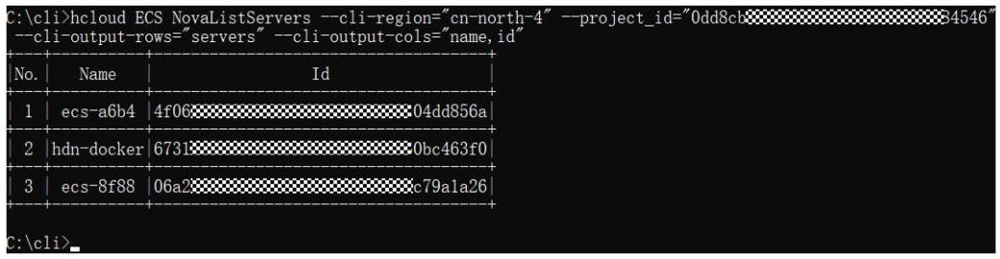
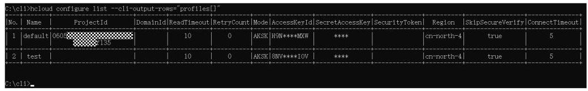
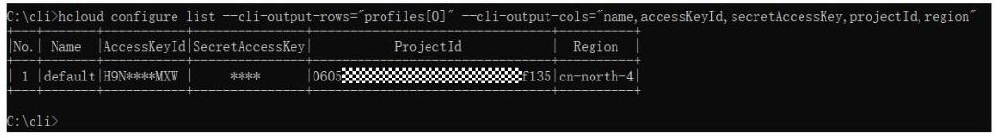

华为云命令行工具服务常见问题

文档版本 01

发布日期 2026-04-10

32

## 版权所有 (C) 华为云计算技术有限公司 2026。保留一切权利。

非经本公司书面许可，任何单位和个人不得擅自摘抄、复制本文档内容的部分或全部，并不得以任何形式传播。

## 商标声明

HUAWE和其他华为商标均为华为技术有限公司的商标。

本文档提及的其他所有商标或注册商标，由各自的所有人拥有。

## 注意

您购买的产品、服务或特性等应受华为云计算技术有限公司商业合同和条款的约束，本文档中描述的全部或部分产品、服务或特性可能不在您的购买或使用范围之内。除非合同另有约定，华为云计算技术有限公司对本文档内容不做任何明示或暗示的声明或保证。

由于产品版本升级或其他原因，本文档内容会不定期进行更新。除非另有约定，本文档仅作为使用指导，本文档中的所有陈述、信息和建议不构成任何明示或暗示的担保。

## 华为云计算技术有限公司

地址: 贵州省贵安新区黔中大道交兴功路华为云数据中心 邮编:55002

网址: https://www.huaweicloud.com/

## 目录

1 概述.

.1

2 认证相关

.4

2.1 获取认证信息

.4

2.2 认证方式优先级

.4

3 配置项相关

.5

3.1 命令中未指定配置项时默认使用哪个配置项？

.5

4 元数据缓存相关

6

4.1 元数据缓存文件存于何处？如何清理？

.6

5 日志相关

.7

5.1 日志文件存于何处？

.7

6 网络连接相关.

.8

6.1 如何解决网络连接超时问题？

..8

7 云服务相关.

10

7.1 提示不支持的服务时如何处理？

.10

8 云服务 API 相关.

.11

8.1 提示不支持的 operation 时如何处理？

11

8.2 如何指定云服务的 API 和版本号？

12

8.3 云服务 API 的响应体为空时，如何判断命令是否执行成功？

.12

9 区域相关.

.14

9.1 提示缺少 cli-region 参数时如何处理？

.14

9.2 提示不支持的 cli-region 时如何处理？

.14

10 参数相关.

16

10.1 KooCLI 系统参数包括哪些？

16

10.2 提示不正确的参数时如何处理？

18

10.3 为什么会有新旧 KooCLI 系统参数，如 cli-region 与 region，推荐使用哪个？

.19

10.4 提示重复的参数时如何处理？

.20

10.5 如何使用 cli-jsonInput? 注意事项有哪些？

21

10.6 使用 cli-jsonInput 的场景有哪些？

.22

10.7 提示不支持的参数位置/类型时如何处理？

22

10.8 云服务 API 的 body 位置参数值如何置空？

.22

11 交互式/自动补全相关.

25

11.1 使用交互式/自动补全需要注意什么？

.25

12 输出格式相关.

26

12.1 KooCLI 支持的输出格式有哪些？

.26

12.2 如何定义 JMESPath 表达式.

26

12.2.1 JMESPath 表达式的用法有哪些？

26

12.2.2 JMESPath 支持的内置函数有哪些？

.34

12.3 KooCLI 与输出相关的系统参数有哪些，推荐使用哪些？

42

12.4 新输出参数 cli-output, cli-query, cli-output-num 在使用时的注意事项有哪些？

43

12.5 旧输出参数 cli-output-rows, cli-output-cols, cli-output-num 如何使用，注意事项有哪些？

43

12.5.1 旧输出参数 cli-output-rows, cli-output-cols, cli-output-num 如何使用？

43

12.5.2 旧输出参数 cli-output-rows, cli-output-cols, cli-output-num 使用时的注意事项有哪些？

.45

12.6 旧输出参数 cli-json-filter 如何使用，注意事项有哪些？

46

12.6.1 旧输出参数 cli-json-filter 如何使用？

46

12.6.2 旧输出参数 cli-json-filter 使用时的注意事项有哪些？

47

13 其他.

49

13.1 无配置方式使用 KooCLI 需要注意什么？

49

13.2 命令中服务名、operation、参数的 value 值是否需要使用双引号引起？

50

13.3 在线/离线模式分别适用什么场景？

50

13.4 如何卸载 KooCLI?

.51

KooCLI将调用命令时出现的错误分为五种类型，在错误提示信息的起始位置声明其具体类型:[NETWORK_ERROR]，[CLI_ERROR]，[USE_ERROR]，[OPENAPI_ERROR] 和[APIE_ERROR]。各类错误的定位方法如下:

- [NETWORK_ERROR]:一般是HTTP请求异常，请检查网络连接；

- [CLI_ERROR]:一般是因KooCLI处理命令过程中本身的异常导致的错误，请联系 KooCLI的oncall协助处理；

- [USE_ERROR]:一般是因命令中参数不正确造成的错误，请根据错误提示做相应修改；

- [OPENAPI_ERROR]:一般是调用云服务API时发生的错误，请联系相关云服务 oncall协助处理；

- [APIE_ERROR]:一般是调用API Explorer获取元数据时发生的错误，请联系API Explorer云服务oncall协助处理。

您也可以根据下表常见问题概览查找所需内容。

表 1-1 常见问题概览

<table><tr><td>常见问题分类</td><td>相关链接</td></tr><tr><td rowspan="5">认证相关</td><td>如何获取永久AK/SK？</td></tr><tr><td>如何获取账号ID、项目ID？</td></tr><tr><td>如何获取区域？</td></tr><tr><td>如何获取临时AK/SK和securitytoken?</td></tr><tr><td>各认证方式的优先级是什么？</td></tr><tr><td>配置项相关</td><td>命令中未指定配置项时默认使用哪个配置项？</td></tr><tr><td>元数据缓存相关</td><td>元数据缓存文件存于何处？如何清理？</td></tr><tr><td>日志相关</td><td>日志文件存于何处？</td></tr><tr><td>网络连接相关</td><td>如何解决网络连接超时问题？</td></tr><tr><td>云服务相关</td><td>提示不支持的服务时如何处理？</td></tr></table>

<table><tr><td>常见问题分类</td><td>相关链接</td></tr><tr><td rowspan="3">云服务API相关</td><td>提示不支持的operation时如何处理？</td></tr><tr><td>如何指定云服务的API和版本号？</td></tr><tr><td>云服务API的响应体为空时，如何判断命令是否执行成功？</td></tr><tr><td rowspan="2">区域相关</td><td>提示缺少cli-region参数时如何处理？</td></tr><tr><td>提示不支持的cli-region时如何处理？</td></tr><tr><td rowspan="8">参数相关</td><td>KooCLI系统参数包括哪些？</td></tr><tr><td>提示不正确的参数时如何处理？</td></tr><tr><td>为什么会有新旧系统参数，如cli-region与 region，在使用时的区别是什么推荐使用哪个?</td></tr><tr><td>提示重复的参数时如何处理？</td></tr><tr><td>如何使用cli-jsonInput？注意事项有哪些？</td></tr><tr><td>使用cli-jsonInput的场景有哪些？</td></tr><tr><td>提示不支持的参数位置/类型时如何处理？</td></tr><tr><td>云服务API的body位置参数值如何置空？</td></tr><tr><td>交互式/自动补全相关</td><td>使用交互式/自动补全需要注意什么？</td></tr><tr><td rowspan="9">输出格式相关</td><td>KooCLI支持的输出格式有哪些？</td></tr><tr><td>JMESPath表达式的用法有哪些？</td></tr><tr><td>JMESPath支持的内置函数有哪些？</td></tr><tr><td>KooCLI与输出相关的系统参数有哪些，推荐使用哪些？</td></tr><tr><td>新输出参数cli-output，cli-query，cli-output-num在使用时的注意事项有哪些？</td></tr><tr><td>旧输出参数cli-output-rows，cli-output-cols, cli-output-num如何使用？</td></tr><tr><td>旧输出参数cli-output-rows, cli-output-cols，cli-output-num使用时的注意事项有哪些?</td></tr><tr><td>旧输出参数cli-json-filter如何使用？</td></tr><tr><td>旧输出参数cli-json-filter使用时的注意事项有哪些?</td></tr><tr><td>其他</td><td>无配置方式使用KooCLI需要注意什么？</td></tr></table>

<table><tr><td>常见问题分类</td><td>相关链接</td></tr><tr><td rowspan="3"></td><td>命令中服务名、operation、参数的value值是否需要使用双引号引起?</td></tr><tr><td>在线/离线模式分别适用什么场景？</td></tr><tr><td>如何卸载KooCLI？</td></tr></table>

### 2.1 获取认证信息

## 获取永久 AK/SK

请参考获取永久AK/SK。

## 获取账号 ID、项目 ID

请参考获取账号ID、项目ID。

## 获取区域

请参考终端节点及区域说明。

## 获取临时 AK/SK 和 securitytoken

请参考获取临时AK/SK和securitytoken。

### 2.2 认证方式优先级

KooCLI在命令解析过程中，依照如下优先级使用其认证方式，完成调用API时的认证流程:

1. 无配置方式AKSK认证:

a. 无配置方式AKSK:命令中直接输入访问密钥(永久AK/SK，即cli-access-key 和cli-secret-key)或临时安全凭证(临时AK/SK和SecurityToken，即cli-access-key, cli-secret-key和cli-security-token)用于认证；

2. 已添加配置项的情况下，命令中直接指定配置项或使用默认配置项；

3. 委托给云服务(目前仅支持通过IAM委托给弹性云服务器，以委托认证的方式在弹性云服务器中使用KooCLI的场景)。

若在解析某认证方式的过程中出现异常，不会尝试使用低于该优先级的方式进行认证。

### 3.1 命令中未指定配置项时默认使用哪个配置项？

## 问题背景

通过KooCLI管理和使用您的各类云服务资源，在调用云服务的API时，KooCLI优先使用命令中 “--cli-profile” 选项指定的配置项。

如您未在命令中指定配置项，会使用默认配置项来调用目标API。

若该配置项的内容与目标API不匹配，或缺少访问目标API时需要的某参数，会提示相关错误，例如:

- [USE_ERROR]请输入cli-region

- [USE_ERROR]cli-region的值不支持,当前支持的区域值如下:*

- [USE_ERROR]缺少必填参数: project_id

- [USE_ERROR]使用AK/SK模式访问全局服务,缺少必填参数cli-domain-id.请添加该参数,或使用`hcloud configure set`配置cli-domain-id

## 解决方案

- 如果您在命令中通过 “--cli-profile” 选项指定了配置项，您可先执行 “hcloud configure show --cli-profile=\$\{profileName\}" 命令查看该配置项的具体内容， 确认您指定的配置项是否合适；

- 如您未在命令中指定配置项，KooCLI会使用默认配置项来调用目标API。您可使用命令“hcloud configure show”查询默认配置项的详情信息；

- 如您需要使用其他配置项，您可通过 “hcloud configure list” 命令查看您已配置的所有配置项，然后使用 “--cli-profile=\$\{profileName\}” 在原调用API的命令中指定目标配置项的名称，重新调用。

### 4.1 元数据缓存文件存于何处？如何清理？

通过KooCLI管理和使用您的各类云服务资源时，会远程获取您命令中目标云服务及其 API的详情信息。为减少远程调用次数，提高响应速度，KooCLI引入了缓存机制，在运行过程中将云服务及其API的相关信息保存在本地缓存文件中，该文件称为元数据缓存文件。在元数据缓存文件过期前，会使用该文件中的信息对命令中的参数进行校验和组装。

- 元数据缓存文件的存放位置

- 在线模式:

- Windows系统:C:\\Users\\\{您的Windows系统用户名\}\\.hcloud \\\\metaRepo\\\\

- Linux系统: /home/\{当前用户名\}/.hcloud/metaRepo/

- Mac系统: /Users/\{当前用户名\}/.hcloud/metaRepo/

- 离线模式:

- Windows系统:C:\\Users\\\{您的Windows系统用户名\}\\.hcloud \\metaOrigin\\

- Linux系统: /home/\{当前用户名\}/.hcloud/metaOrigin/

- Mac系统: /Users/\{当前用户名\}/.hcloud/metaOrigin/

- 如何清理元数据缓存文件

- 在线模式:

清理缓存文件时执行命令“hcloud meta clear”即可。元数据缓存文件清理后，调用API时会重新获取并写入新文件。

- 离线模式:

执行命令 “hcloud meta clear”，会清理从已下载的离线元数据包中解析出来的元数据缓存文件，离线元数据包仍然保留。之后调用API时，会重新从该离线元数据包中解析并写入新元数据缓存文件。

### 5.1 日志文件存于何处？

KooCLI会记录您使用过程中产生的日志信息。日志记录功能暂不支持关闭。

日志文件名称为 “hcloud.log”，日志文件的存放位置如下:

- Linux系统:/home/\{当前用户名\}/.hcloud/log/

- Windows系统:C:\\Users\\\{当前用户名\}\\.hcloud\\log\\

- Mac系统:/Users/\{当前用户名\}/.hcloud/log/

### 6.1 如何解决网络连接超时问题？

## 问题背景

KooCLI调用云服务API的过程中，会对您输入参数的合法性进行校验，此校验过程可能需要远程获取该云服务和API的详情信息；在参数校验完成后，亦需要远程调用您的目标API。如在调用过程中因网络连接问题导致请求失败，会提示相关错误，例如:

- [NETWORK_ERROR]连接超时,请检查网络连通性

- [USE_ERROR]调用API超时,请先检查配置项或命令中的readTimeout的值

- [NETWORK_ERROR]连接超时*次(重试*次)请检查网络连通性

## 解决步骤

1. 如遇如上情形，请您先检查您的网络连通是否正常；

2. 如您网络连接确认无异常，错误信息中提示您“连接超时”，可能是配置项或命令中的cli-connect-timeout的值过小，您可以通过如下方式修改该值:

- 若您已在命令中使用 “--cli-connect-timeout” 选项，请适当增大其值，重新调用；

- 如您未在命令中使用 “ --cli-connect-timeout” 选项，会在命令执行过程中使用当前配置项中该参数的值。您可以通过在当前命令中添加 "--cli-connect-timeout=\\(\{connectTimeout\}"，临时覆盖配置项中该参数值，重新调用。 若您需要修改配置项中该参数的值，请您执行 "hcloud configure set --cli-profile=$\{profileName\} --cli-connect-timeout=\$\{connectTimeout\}" 命令;

3. 如您网络连接确认无异常，错误信息中提示您检查 “readTimeout”，可能是配置项或命令中的 "cli-read-timeout" 的值过小, 您可通过如下方式修改该值:

- 若您已在命令中使用 “--cli-read-timeout” 选项，请适当增大其值，重新调用；

- 如您未在命令中使用 “--cli-read-timeout” 选项，会在命令执行过程中使用当前配置项中该参数的值。您可以在当前命令中添加 "--cli-read-timeout=\$ \{readTimeout\}"，临时覆盖配置项中该参数值，重新调用。若您需要修改配

置项中该参数的值，请您执行 “hcloud configure set --cli-profile=\\( \{profileName\} --cli-read-timeout=$\{readTimeout\}" 命令。

### 7.1 提示不支持的服务时如何处理？

## 问题背景

KooCLI调用云服务API的过程中，会对您输入参数的合法性进行校验。如果您命令中云服务的名称输入有误，或调用的云服务未在KooCLI上线，会提示相关错误:

[USE_ERROR]不支持的服务名称:*

## 解决步骤

1. 如遇如上情形，您可先通过执行 “hcloud --help” 命令，查看当前支持的所有云服务，确认服务名称是否有误；

2. 如您确认服务名无误，但是上一步执行 “hcloud --help” 命令的输出结果中， “可用服务”列表中不存在该云服务，可能是因为如下原因:

a. 若您已使用在线模式，则该云服务未在KooCLI上线；

b. 若您已使用离线模式，可能是您当前使用的离线数据包并非最新版本，导致参数校验不通过。您可先执行 “hcloud meta download” 命令，更新离线数据包后，再重新执行1中的命令。若结果中仍不存在该云服务，则该云服务未在KooCLI离线模式中上线，请等待离线数据包更新，或切换至在线模式尝试;

3. 如您的错误提示信息是英文，说明您此前已在配置中将KooCLI语言设置为英文， 或KooCLI判断您的系统语言为英文。目前英文环境下KooCLI中上线的云服务与中文环境存在差异。若您要将语言设置为中文，您可以通过执行 “hcloud configure set --cli-lang=cn”命令修改语言配置。

### 8.1 提示不支持的 operation 时如何处理？

## 问题背景

KooCLI调用云服务API的过程中，会对您输入参数的合法性进行校验。如果您命令中 API的operation输入有误，或该API未在KooCLI上线，会提示如下错误:

[USE_ERROR]不支持的operation: *

## 解决步骤

1. 如遇如上情形，您可先通过执行 “hcloud <service> --help” 命令，查看该云服务支持的operation列表，确认operation是否误输；

2. 如您确认operation无误，但是在执行上一步 “hcloud <service> --help” 命令的输出结果中，"Available Operations" 列表中不存在该operation，可能是因为如下原因:

a. 若您已使用在线模式，则该API未在KooCLI上线；

b. 若您已使用离线模式，可能是您当前使用的离线数据包并非最新版本，导致参数校验不通过。您可先执行“hcloud meta download”命令，更新离线数据包后，再重新执行1中的命令。若结果中仍不存在该operation，则该API未在KooCLI离线模式中上线，请等待离线数据包更新，或切换至在线模式尝试;

3. 如您的错误提示信息是英文，说明您此前已在配置中将KooCLI语言设置为英文， 或KooCLI判断您的系统语言为英文。目前英文环境下KooCLI中开放的云服务及其 API与中文环境存在差异。若您要将语言设置为中文，您可以通过执行 “ hcloud configure set --cli-lang=cn" 命令修改语言配置。

### 8.2 如何指定云服务的 API 和版本号？

## 问题背景

KooCLI调用云服务API的过程中，会对您输入参数的合法性进行校验。若您当前调用的云服务是多版本服务，即意味着该服务中的部分或全部API有多个版本。因同一API不同版本的参数、使用场景等可能存在差异，故需获取多版本服务API的版本信息。

## 云服务 API 的版本查询与指定

- 版本查询

您可以通过 “hcloud <service> --help” 命令，查看该云服务的operation列表。 若在查询结果的 “Available Operations” 中某operation出现多次，且以 “/” 拼接了不同的版本号，则调用该API时需要指定其版本信息，方法请参考版本指定。 其余在该云服务operation列表中只出现了一次的operation不必拼接版本号, KooCLI默认调用其唯一版本。

- 版本指定

- 手动添加版本信息

当调用多版本服务的API时，您可以手动在原API的operation后以 “/” 拼接版本信息。例如:若原命令中operation为 “showLogs”， “Available Operations”列表中存在“showLogs/v1”和“showLogs/v2”，您可根据需要将原命令中的operation修改为 “showLogs/v1” 或 “showLogs/v2”。

- 使用默认版本信息

当调用多版本服务的API时，若您未在命令中指明其版本信息，KooCLI会在运行过程中获取该API可选的所有版本，将其按字母排序，并默认调用其排序后的最后一个版本(一般认为该版本即是该API的最新版本)。

## 扩展问题及其解决方案

- 扩展问题

当您使用默认版本信息的方式调用多版本云服务的API时，若您本地缓存的元数据文件被修改，可能会导致KooCLI在执行过程中无法根据缓存文件正确解析到该API 的版本信息。在此情形下，会提示如下错误:

[USE_ERROR]服务为多版本,请指定API版本号

- 解决方案

如遇如上情形，您可通过执行 “hcloud meta clear” 命令清理当前的元数据缓存文件后，重新调用。

### 8.3 云服务 API 的响应体为空时，如何判断命令是否执行成 功?

## 问题背景

使用KooCLI调用部分云服务的API时，API的返回结果为空，CLI不会打印相应返回体， 用户无法确认是否调用成功。

## 解决步骤

在原命令中添加 “--debug” 参数，可打印命令调用过程中的调试信息。其中包含一行内容为 “API response status code is xxx.”。用户可以根据该返回体的状态码判断命令是否成功调用。

### 9.1 提示缺少 cli-region 参数时如何处理？

## 问题背景

使用KooCLI调用所有云服务的API时，都需要指定区域(即cli-region)。如果您未在命令中指定cli-region值，且您当前使用的配置项中也未配置cli-region值，会提示如下错误:

[USE_ERROR]请输入cli-region

## 解决步骤

1. 如遇如上情形，若您未在命令中指定cli-region值，您可在当前命令中添加 “--cli-region=\$\{regionValue\}", 重新调用;

2. 如您有常用的区域，可使用 "hcloud configure set --cli-profile=\\(\{profileName\} --cli-region=$\{regionValue\}" 命令将其配置到目标配置项中。后续使用该配置项调用API时，命令中可以不必输入cli-region；但若目标API不支持该cli-region，则您仍需在命令中通过 "--cli-region=\$\{regionValue\}" 传入支持的cli-region。

### 9.2 提示不支持的 cli-region 时如何处理？

## 问题背景

使用KooCLI调用所有云服务的API时，都需要提供合适的cli-region。如果您遇到如下几种情况:

- 命令中cli-region值输入有误；

- 命令指定了cli-region值，但目标API不支持该cli-region；

- 命令中未指定cli-region值，目标API不支持从当前配置项中获取的cli-region。

会提示如下错误:

[USE_ERROR]cli-region的值不支持,当前支持的区域值如下:*

[USE_ERROR]当前配置项中cli-region的值不支持,当前支持的区域值如下:*

## 解决步骤

1. 如遇如上情形时，请您参考该提示信息中支持的cli-region列表，确认cli-region值是否误输；

2. 若您确认cli-region值无误，但命令执行时提示如上错误，可能是因为如下原因:

a. 若您已使用在线模式，则目标API不支持该cli-region，请你按照实际情况修改:

i. 命令中指定了cli-region值，请您参考该提示信息中支持的cli-region列表，修改命令中的cli-region值，重新调用；

ii. 命令中未指定cli-region值，KooCLI会在运行过程中解析并使用当前配置项中的cli-region值。您可根据错误提示中支持的cli-region列表，在当前命令中添加 "--cli-region=\\(\{regionValue\}" 后重新调用。如您要修改配置项中cli-region的值，请您执行 "hcloud configure set --cli-profile=$ \{profileName\} --cli-region=\$\{regionValue\}" 命令;

b. 若您已使用离线模式，可能是您当前使用的离线数据包并非最新版本，导致参数校验不通过。您可先执行“hcloud meta download”命令，更新离线数据包后，再重新执行原命令；若仍提示如上错误，则该cli-region值未在 KooCLI离线模式中上线，请等待离线数据包更新，或切换至在线模式尝试；

3. 如KooCLI在执行命令的过程中未提示您如上所述的错误信息，但调用API的返回值显示region错误，可能是因您本地缓存cli-region列表的文件被修改，导致参数校验失其准确性。此时请您执行 “hcloud meta clear” 命令清理本地缓存文件后， 重新调用；

4. 如您的错误提示信息是英文，说明您此前已在配置中将KooCLI语言设置为英文， 或KooCLI判断您的系统语言为英文。目前英文环境下KooCLI中云服务的各API支持的cli-region与中文环境存在差异。若您要将语言设置为中文，您可以通过执行 “hcloud configure set --cli-lang=cn” 命令修改语言配置；

### 10.1 KooCLI 系统参数包括哪些？

## 系统参数

KooCLI系统参数是指其内置参数，各系统参数的描述信息及其使用方式如下表所示:

表 10-1 KooCLI 新系统参数

<table><tr><td>参数</td><td>参数描述</td><td>使用方式</td></tr><tr><td>help</td><td>打印帮助信息</td><td>命令中直接使用</td></tr><tr><td>debug</td><td>打印调试信息</td><td>命令中直接使用</td></tr><tr><td>dryrun</td><td>执行校验后打印请求报文，跳过实际运行</td><td>命令中直接使用</td></tr><tr><td>interactive</td><td>进入交互式模式</td><td>命令中直接使用</td></tr><tr><td>cli-region</td><td>区域</td><td>配置于配置项后使用 / 命令中直接使用</td></tr><tr><td>cli-access-key</td><td>AK/SK模式时需要的参数Access Key ID</td><td>配置于配置项后使用 / 命令中直接使用</td></tr><tr><td>cli-secret-key</td><td>AK/SK模式时需要的参数Secret Access Key</td><td>配置于配置项后使用 / 命令中直接使用</td></tr><tr><td>cli-domain-id</td><td>账号ID</td><td>配置于配置项后使用 / 命令中直接使用</td></tr><tr><td>cli-project-id</td><td>项目ID</td><td>配置于配置项后使用 / 命令中直接使用</td></tr><tr><td>cli-profile</td><td>指定配置项,缺省时使用默认配置项</td><td>配置于配置项后使用 / 命令中直接使用</td></tr></table>

<table><tr><td>参数</td><td>参数描述</td><td>使用方式</td></tr><tr><td>cli-mode</td><td>认证模式[AKSK|ecsAgency]</td><td>配置于配置项后使用 / 命令中直接使用</td></tr><tr><td>cli-jsonInput</td><td>通过JSON文件方式传入API参数</td><td>命令中直接使用</td></tr><tr><td>cli-output</td><td>响应数据的输出格式[json|table| tsv]</td><td>命令中直接使用</td></tr><tr><td>cli-query</td><td>筛选响应数据的JMESPath路径</td><td>命令中直接使用</td></tr><tr><td>cli-output-num</td><td>table输出时，是否打印表格的行号。取值为true或false，默认为 true</td><td>命令中直接使用</td></tr><tr><td>cli-endpoint</td><td>自定义请求域名</td><td>命令中直接使用</td></tr><tr><td>cli-connect-timeout</td><td>请求连接超时时间(秒)，默认值5 秒，参数最小取值为1秒</td><td>配置于配置项后使用 / 命令中直接使用</td></tr><tr><td>cli-read-timeout</td><td>I/O超时时间(秒)，默认值10秒， 参数最小取值为1秒</td><td>配置于配置项后使用 / 命令中直接使用</td></tr><tr><td>cli-retry-count</td><td>请求连接重试次数，默认取值为0 次，参数取值范围为0~5次</td><td>配置于配置项后使用 / 命令中直接使用</td></tr><tr><td>cli-lean</td><td>用户获取的临时token，必须和临时AK/SK同时使用</td><td>配置于配置项后使用 / 命令中直接使用</td></tr><tr><td>cli-lang</td><td>语言，取值为cn或en</td><td>配置于配置项后使用</td></tr><tr><td>cli-offline</td><td>是否使用离线模式。取值为true或 false，默认为false</td><td>配置于配置项后使用</td></tr><tr><td>cli-skip-secure-verify</td><td>是否跳过https请求证书验证(不建议)。取值为true或false，默认为 false</td><td>配置于配置项后使用 / 命令中直接使用</td></tr><tr><td>cli-agree-privacy-statement</td><td>是否同意隐私。取值为true或 false，默认为false</td><td>配置于配置项后使用</td></tr><tr><td>cli-warning</td><td>是否提示命令执行过程中的 Warning信息。取值为true或 false，默认为true</td><td>配置于配置项后使用</td></tr></table>

对上表中所列的各参数使用方式解释如下:

- 仅支持配置于配置项后使用:

指该参数只可以通过 “hcloud configure set --key1=value1 --key2=value2 ...” 命令配置到配置项后再使用。使用时在命令中通过 “--cli-profile=\$\{profileName\}” 指定配置项名称，KooCLI即会在运行过程中解析并使用该配置项中配置的各项参数值。

若在命令中直接使用该类参数，会提示如下错误:

[USE_ERROR]不正确的参数:*

- 仅支持命令中直接使用:

指该参数只可以通过 “--key1=value1 --key2=value2 ...” 直接在命令中使用。

若将该类参数配置到配置项中，会提示如下错误:

[USE_ERROR]不正确的参数:*

- 配置于配置项后使用 / 命令中直接使用:

指该类参数既可以通过 “hcloud configure set --key1=value1 --key2=value2 ...” 命令配置到配置项后再使用，也可以通过 “--key1=value1 --key2=value2 ...” 直接在命令中使用。对于同一参数，KooCLI会在运行过程中优先使用命令中指定的该参数值。未在命令中指定的参数，则使用当前配置项中其值。

与新系统参数相关的KooCLI旧系统参数参见下表。

### 10.2 提示不正确的参数时如何处理？

## 问题背景

通过KooCLI管理和使用您的各类云服务资源时，在调用云服务API的过程中，会对您输入参数的合法性进行校验。若您在命令中输入了当前API不支持的参数，或将只允许配置在配置项中使用的参数在命令直接传入，会提示如下错误:

[USE_ERROR]不正确的参数:*

## 解决步骤

1. 如遇如上情形，您可以通过执行 "hcloud <service> <operation> --help”命令， 对比输出结果中“Params”的内容，即当前API的参数列表，若其中不存在该参数，可能是因为如下原因:

a. 若您已使用在线模式，则该API不支持该参数，请根据输出结果中 “Params”的内容修改该参数；

b. 若您已使用离线模式，可能是您当前使用的离线数据包并非最新版本，导致参数校验不通过。您可先执行“hcloud meta download”命令，更新离线数据包后，再重新执行1中的命令。若结果中仍不存在该参数，则该API数据未在KooCLI离线模式中更新，请等待离线数据包更新，或切换至在线模式尝试;

2. 如您是在调用云服务API的命令中直接输入如 “cli-lang” 的系统参数，会提示相关错误信息。因为如上参数只支持被配置到配置项中使用，配置命令为 “hcloud configure set --key1=value1 --key2=value2 ...”;

3. 如KooCLI在命令执行过程中未提示您如上所述的错误信息，但调用API的返回值显示参数有误，可能是因您本地缓存API详情的文件被修改，导致参数校验失其准确性。您可通过执行 “hcloud meta clear” 命令清理当前的缓存文件后，重新执行 "hcloud <service> <operation> --help”命令，再次确认目标API的参数列表中是否包含该参数。

### 10.3 为什么会有新旧 KooCLI 系统参数，如 cli-region 与 region，推荐使用哪个？

## 问题背景

在KooCLI系统参数列表中，部分参数同时存在两种形式，如 “--cli-region” 和 “-- region”。其中，未添加“cli-”前缀的称为旧系统参数；添加了“cli-”前缀的称为新系统参数。之所以支持新系统参数，是因为在KooCLI上开放的云服务中，存在部分API 的某参数与旧系统参数重名的情况。该场景可能会使命令中两个同名的参数用于不同的用途，即:其一作为目标API参数，另一作为系统参数。在命令执行过程中会对参数的合法性进行检查，若命令中存在重复参数，则会提示如下错误:

[USE_ERROR]重复的参数*,如非误输,请以'cli-*'为key输入其中的KooCLI系统参数

另外，若云服务的API中存在(或可自定义)与旧系统参数同名的参数，则若该参数出现在命令中，KooCLI将无法确认该参数作何种用途。故在解析该命令的过程中，会通过交互向信息向用户确认该参数的实际用途，避免解析错误。例如:

- 目标API中存在与KooCLI系统参数%s同名的参数,无法识别命令中%s的位置.请确认该参数为:KooCLI系统参数(a);目标API参数(b);兼为两者(c):

- 目标API中可自定义与KooCLI系统参数%s同名的参数,无法识别命令中%s的位置. 请确认该参数为:KooCLI系统参数(a);目标API参数(b);兼为两者(c):

因此，当您构建KooCLI命令时，对于其中的系统参数，为避免出现参数冲突而引起错误或交互，推荐使用新系统参数。

## ☐ 说明

新增系统参数将添加至新系统参数列表中。旧系统参数将仅维持其已有功能，不再持续升级。

## 旧系统参数

KooCLI旧系统参数的描述信息及其对应的新系统参数如下表所示:

表 10-2 KooCLI 旧系统参数

<table><tr><td>旧系统参数</td><td>参数描述</td><td>其对应的新系统参数</td></tr><tr><td>region</td><td>指定区域</td><td>cli-region</td></tr><tr><td>access-key</td><td>AK/SK模式时需要的参数Access Key ID</td><td>cli-access-key</td></tr><tr><td>secret-key</td><td>AK/SK模式时需要的参数Secret Access Key</td><td>cli-secret-key</td></tr><tr><td>domain-id</td><td>账号ID</td><td>cli-domain-id</td></tr><tr><td>project-id</td><td>项目ID</td><td>cli-project-id</td></tr><tr><td>profile</td><td>指定配置项</td><td>cli-profile</td></tr><tr><td>mode</td><td>认证模式[AKSK|ecsAgency]</td><td>cli-mode</td></tr></table>

<table><tr><td>旧系统参数</td><td>参数描述</td><td>其对应的新系统参数</td></tr><tr><td>jsonInput</td><td>通过JSON文件方式传入API参数</td><td>cli-jsonInput</td></tr><tr><td>output-cols</td><td>table输出时，指定需要打印的字段</td><td>cli-output-cols</td></tr><tr><td>output-rows</td><td>table输出时，指定需要打印的层级</td><td>cli-output-rows</td></tr><tr><td>output-num</td><td>table输出时，是否打印表格的行号。取值为true或false，默认为 true</td><td>cli-output-num</td></tr><tr><td>json-filter</td><td>json输出时,对json结果执行 JMESPath查询</td><td>cli-json-filter</td></tr><tr><td>connect-timeout</td><td>请求连接超时时间(秒)，默认值5 秒，参数最小取值为1秒</td><td>cli-connect-timeout</td></tr><tr><td>read-timeout</td><td>I/O超时时间(秒)，默认值10秒， 参数最小取值为1秒</td><td>cli-read-timeout</td></tr><tr><td>retry-count</td><td>请求连接重试次数，默认取值为0 次，参数取值范围为0~5次</td><td>cli-retry-count</td></tr><tr><td>security-token</td><td>用户获取的临时token，必须和临时AK/SK同时使用</td><td>cli-security-token</td></tr><tr><td>lang</td><td>语言，取值为cn或en</td><td>cli-lang</td></tr></table>

### 10.4 提示重复的参数时如何处理？

## 问题背景

KooCLI在命令执行过程中会对参数的合法性进行检查，若命令中存在重复参数，视具体场景不同，会提示不同错误，例如:

1. [USE_ERROR]重复的参数:*

2. [USE_ERROR]重复的参数*,如非误输,请以cli-*为key输入其中的KooCLI系统参数

3. [USE_ERROR]重复的*,如非误输,请将其中的API参数通过'--cli-jsonInput=xx'传入, 详情参考...

在KooCLI系统参数列表中，部分参数同时存在两种形式，如 “--cli-region” 和 “-- region”。之所以同一系统参数同时支持两种参数名，是因为在KooCLI上开放的云服务中，存在部分API的某参数与系统参数重名的情况。

## 解决方案

1. 若提示的错误信息为上述第一种，则命令中可能存在重复的非系统参数，请您检查是否误输。此错误也可能与系统解析处理命令内容有关，若参数值有特殊符号，请使用双引号引起，避免解析错误。

2. 若提示的错误信息为上述第二种，说明命令中存在重复的旧系统参数，您可使用 "hcloud <service> <operation> --help”命令，对比输出结果中“Params”的内容，即当前API的参数列表，确认目标API中是否存在该参数，或存在可自定义参数名称的参数(即名称为“\{*\}”的参数)。若不存在，请您检查是否误输。若存在，则您可能需要将同名的两个参数用于不同用途，即:其一作为目标API参数，另一作为系统参数。您可根据提示信息，使用新系统参数替换原命令中的旧系统参数。当命令中同时存在同一系统参数的新旧两种形式时，例如命令中存在 "--cli-region=\\(\{regionValue1\} --region=$\{regionValue2\}", KooCLI会根据当前API的参数列表自动识别各个参数的用途:

- 若目标API中存在 “region” 同名参数，或可自定义参数名称，KooCLI会在命令执行过程中自动将 “--cli-region” 识别为系统参数，其值用于获取目标API 的详情信息；而将 “--region” 识别为目标API的参数，其值将用于目标API的调用。

- 若目标API中不存在“region”同名参数，也不可自定义参数名称，KooCLI会在命令执行过程中自动将 “ -cli-region” 识别为系统参数，其值用于获取目标API的详情信息，同时会忽略命令中传入的“ --region”参数。

当您构建KooCLI命令时，对于其中的系统参数，为避免出现参数冲突而引起错误或交互，推荐使用新系统参数。

3. 若提示的错误信息为上述第三种，说明命令中存在重复的新系统参数，您可使用 "holoud <service> <operation> --help”命令，对比输出结果中“Params”的内容，即当前API的参数列表，确认目标API中是否存在该参数，或存在可自定义参数名称的参数(即名称为“\{*\}”的参数)。若不存在，请您检查是否误输。若存在(此种冲突的情况出现的概率极小)，请您将命令中的API参数写入cli-jsonInput文件中，以JSON文件的方式传递API参数。

### 10.5 如何使用 cli-jsonInput? 注意事项有哪些？

## 问题背景

命令提示符(cmd.exe)等工具对使用时输入的字符串的最大长度有限制。当需要执行的命令的参数过多或参数值过长时，可能会因为其长度限制导致命令输入不完整。因此KooCLI除了支持参数在命令中直接输入之外，也支持使用 “--cli-jsonInput=\$ \{jsonFileName\}”传入JSON文件，向KooCLI传递云服务API参数。KooCLI会在运行时解析并使用该JSON文件中的参数调用目标API。

## 使用方式

cli-jsonInput的使用方式请参考:以JSON文件的方式传递API参数。

## 注意事项

- “--cli-jsonInput”选项传入的JSON文件中目前只支持写入云服务的API参数，不支持写入系统参数。若目标API中存在与新系统参数或旧系统参数重名的参数，被写入jsonInput文件中的默认将被识别为该API的参数；

- “--cli-jsonInput”选项传入的JSON文件中，KooCLI会根据JSON最外层的Key获取并解析其的参数值，目前支持的Key包括:path、query、body、formData、 header、cookie。JSON最外层的其他Key下的内容将会被忽略。若JSON文件里所有最外层的Key都不属于上述支持的Key之一，会提示如下错误:

[USE_ERROR]cli-jsonInput文件内容不符合要求,详情请参考...

- 使用“--cli-jsonInput”选项传入云服务API参数时，同一位置的API参数必须全部写入JSON文件，或全部通过命令直接传入，否则可能会导致参数解析不完整，会提示如下错误:

[USE_ERROR]缺少必填参数:*

- “--cli-jsonInput”选项只支持传入JSON格式的文件，且文件扩展名必须为 “.json”，支持传入的最大文件为5MB；使用“--cli-jsonInput”时，会校验 JSON文件的格式及文件中参数的类型。若JSON文件的格式有误，会提示:

[USE_ERROR]cli-jsonInput参数的文件解析失败,文件中参数有误

若JSON文件中某参数的类型不被支持，会提示:

[USE_ERROR]不支持参数*的值的类型

- 使用 “--cli-jsonInput” 选项传入云服务API参数时，参数的取值不支持使用 custom参数。

### 10.6 使用 cli-jsonInput 的场景有哪些？

1. 云服务的API参数名称中带有“.”，KooCLI可能无法正确解析该参数，此时需通过cli-jsonInput传入该API的参数；

2. 云服务的API在不同位置中有同名的参数时，KooCLI无法正确解析该API的参数， 此时需通过cli-jsonInput传入该API的参数；

3. 用户输入的云服务API参数值中包含空格或特殊符号，通过终端调用KooCLI命令时，其参数值可能发生传递错误，此时需通过cli-jsonInput传入该API的参数；

4. 用户输入的云服务API参数值过长，受终端输入字符长度的限制，可能导致命令输入不完整，此时需通过cli-jsonInput传入该API的参数。

### 10.7 提示不支持的参数位置/类型时如何处理？

## 问题背景

通过KooCLI管理和使用您的各类云服务资源，在调用云服务API的过程中，KooCLI会对您输入参数的合法性进行校验。在此校验过程中，KooCLI会获取该API中所有参数的详情信息，其中包括每个参数的类型、在request中的位置等信息。若您本地缓存的元数据文件被修改，可能会使KooCLI在运行过程中无法根据缓存文件正确解析到该API的参数详情，导致校验时提示如下错误:

- [CLI_ERROR]参数*的位置不正确:*

- [USE_ERROR]不支持的参数类型:key=*, type=*

## 解决方案

如遇如上情况，您可执行 “hcloud meta clear” 命令清理当前的元数据缓存文件后， 重新调用。

### 10.8 云服务 API 的 body 位置参数值如何置空？

对于云服务API的body位置的参数，KooCLI支持在任意层级置空:

- 若当前层级的值实际类型为map，则置空时参数值应为 “\{\}”。

- 若当前层级的值实际类型为数组，则置空时参数值应为 “[]”。

---

以云服务“ECS”的operation“BatchStopServers”为例，其body位置存在参数“os-

stop.servers.[N].id" 和 "os-stop.type"，如下:

hcloud ECS BatchStopServers --cli-region=cn-north-4 --help

KooCLI(Koo Command Line Interface) Version 3.2.8 Copyright(C) 2020-2023 www.huaweicloud.com

Service:

											ECS

		Description:

												根据给定的云服务器ID列表,批量关闭云服务器,一次最多可以关闭1000台。

	Method:

													POST

		Params:

															--cli-region

																									required string 当前可调用的区域.若命令中未输入,将使用当前配置项中的cli-region

														--os-stop.servers.[N].id

																											required string body 云服务器ID。格式为:--os-stop.servers.1.id=value1 ...

														--project_id

																								required string path 项目ID。若命令中未输入,将根据认证信息获取指定区域的父级项目ID,或使用当前配

			置项中的cli-project-id

															--os-stop.type

																												optional string body 关机类型,默认为SOFT:。[SOFT|HARD]

																												- SOFT:普通关机(默认)。

																												- HARD:强制关机。

---

- 不置空:

给参数 "os-stop.servers.[N].id" 和 "os-stop.type" 分别传入参数值，使用 " -- dryrun" 查看请求body体内容，如下:

hcloud ECS BatchStopServers --cli-region=cn-north-4 --os-stop.servers.1.id="test" --os-stop.type="SOFT" --dryrun

---

POST https://ecs.cn-north-4.myhuaweicloud.com/v1/0a152ab***************262d035e8/cloudservers/

action

Content-Type: application/json;charset=UTF-8

X-Project-Id: 0a152ab************262d035e8

X-Sdk-Date: 20221116T121721Z

Authorization: ***

\{

	"os-stop": \{

		"servers": [

		\{

			"id": "test"

		\}

		],

		"type": "SOFT"

\}

\}

---

- 数组类型参数置空:

若将参数“os-stop.servers.[N].id”的数组(即“[N]”及其之后的内容)置空， 因“os-stop.servers”指向的值实际类型为数组，故可传入参数“--os-stop.servers="[]""，使用 "--dryrun" 查看请求body体内容，如下:

hcloud ECS BatchStopServers --cli-region=cn-north-4 --os-stop.servers="[]" --os-stop.type="SOFT" -- dryrun

--------------------------------------------------------------------------------------------

---

POST https://ecs.cn-north-4.myhuaweicloud.com/v1/0a152ab*************262d035e8/cloudservers/

	action

	X-Project-Id: 0a152ab***************262d035e8

	X-Sdk-Date: 20221116T122841Z

Authorization: ****

	Content-Type: application/json;charset=UTF-8

	\{

																		"os-stop": \{

																														"servers": [],

																														"type": "SOFT"

								\}

\}

---

- map类型参数置空:

若将参数 “os-stop.servers.[N].id” 和 “os-stop.type” 的共有的父级 “os-stop”

置空，因其指向的值实际类型为map，故可传入参数 "--os-stop="\{\}""，使用

“--dryrun”查看请求body体内容，如下:

hcloud ECS BatchStopServers --cli-region=cn-north-4 --os-stop="\{\}" --dryrun

dry-run模式跳过实际运行，当前请求为:

POST https://ecs.cn-north-4.myhuaweicloud.com/v1/0a152ab

action

Content-Type: application/json;charset=UTF-8

X-Project-Id: 0a152ab*************262d035e8

X-Sdk-Date: 20221117T013616Z

Authorization: ****

\{

"os-stop": \{\}

\}

KooCLI执行过程中会校验参数值是否匹配，若将不适合的空值传给参数，会提醒错误信息。例如给实际为map类型的参数“os-stop”赋值数组类型的空值“[]”，则提示如下错误:

[USE_ERROR]map类型参数os-stop的值不正确

### 11.1 使用交互式/自动补全需要注意什么？

在bash环境下，使用 “hcloud auto-complete on” 可开启自动补全，使用自动补全时需注意:

- 自动补全提示参数时，若提示的参数名中有“[N]”，其含义为索引位，请使用数字代替该字符；若提示的参数名中有“\{*\}”，其含义为自定义参数名称，请使用任意不含“.”的字符串代替该字符；

- 若同一机器同一用户的多个目录下有KooCLI，且其中某一目录下的工具开启了自动补全，则该用户其他目录下的KooCLI也可完成自动补全功能。

使用交互模式时需注意:

交互式提示参数时，若提示的参数名中有“[N]”，其含义为索引位，请使用数字代替该字符；若提示的参数名中有“\{*\}”，其含义为自定义参数名称，请使用任意不带 “.”的字符串代替该字符。

### 12.1 KooCLI 支持的输出格式有哪些？

KooCLI支持三种输出格式:json，table，tsv。默认以json格式输出。您可以使用“__ cli-output" 参数指定如前所述的任意一种输出格式，您也可以配合使用 "--cli-query" 选项传入JMESPath表达式，对json结果执行JMESPath查询，以过滤出您需要的信息。输出效果可参考此示例:指定结果的输出格式。构造JMESPath表达式，请参考如何定义JMESPath表达式。

### 12.2 如何定义 JMESPath 表达式

#### 12.2.1 JMESPath 表达式的用法有哪些？

JMESPath表达式的用法如下:

- 基本表达式

- 标识符:

最简单的JMESPath表达式是标识符, 它在json对象中选择一个键:

\{"a": "foo", "b": "bar", "c": "baz"\}

对于如上的 json 内容，当表达式为"a" 时，可获取结果:"foo"。

另请注意，如果指定一个不存在的键，KooCLI会提示错误告警信息并输出原 json结果。

- 子表达式:

使用子表达式返回json对象中的嵌套值:

\{"a": \{"b": \{"c": \{"d": "value"\}\}\}\}

对于如上的json内容，当表达式为"a.b.c.d" 时，可获取结果:"value"。

如果指定是不存在的键，KooCLI会提示错误告警信息并输出原json结果。

- 索引表达式:

索引表达式允许您在列表中选择特定元素，起始索引位为0:

["a", "b", "c", "d", "e", "f"]

对于如上的json内容，当表达式为"[1]" 时，可获取结果:"b"。

如果指定了大于列表的索引，KooCLI会提示错误告警信息并输出原json结果。用户也可以使用负索引从列表末尾到索引。 [-1]指列表中的最后一个元素，[-2]指倒数第二个元素。

- 可以将标识符、子表达式和索引表达式组合在一起，以访问 json 元素:

---

\{"a": \{

																	"b": \{

																														"c": [

																																									\{"d": [0, [1, 2]]\},

																																									\{"d": [3, 4]\}

																									]

										\}

\}\}

---

对于如上的json内容，当表达式为"a.b.c[0].d[1][0]" 时，可获取结果:1。

- 切片

切片的一般形式是[开始:停止:步长]。一般多使用默认步长值1，故其形式也可以是[开始:停止]。切片允许用户选择数组的连续子集。在JMESPath最简单的形式中，用户可以指定起始索引和结束索引。结尾索引的值不会被包含在结果中: [0,1,2,3,4,5,6,7,8,9]

对于如上的json内容，当表达式为"[0:5]" 时，可获取如下结果:

---

0,

1,

2,

	3,

	4

---

此切片结果包含索引 0、1、2、3和4的元素。不包括索引5中的元素。

当表达式为"[5:10]" 时，可获取如下结果:

---

5,

6,

	7,

	8,

	9

---

上面的两个例子中的表达式可以缩短。如果省略了开始或停止值，则默认从数组的第一个元素开始或至最后一个元素停止。例如:

当表达式为"[:5]" 时，可获取如下结果:

0,

1,

2,

3,

4

默认情况下，步长值为1，这意味着选择了在开始和停止值范围内的每个元素。用户也可以使用步长跳过元素。例如，仅从数组中选择偶数元素:当表达式为"[::2]" 时，可获取如下结果:

0,

2,

4,

6,

8

另需注意，在此示例中，省略了开始和停止值，这意味着使用0表示开始值，10用于停止值。在此示例中，表达式 [::2]等于[0:10:2]。

如果步长为负值，则切片按相反顺序创建。例如:当表达式为"[::-1]" 时，可获取如下结果:

---

	2,

	1,

	0

]

---

- 投影

投影是JMESPath的主要特征之一。它允许用户将表达式应用于元素集合。投影共分为五种:列表投影，切片投影，对象投影，扁平投影，过滤投影。

- 列表投影

用通配符表达式创建列表投影，它是对json数组的投影。

---

	\{

																					"people": [

																														\{"first": "James", "last": "d"\},

																														\{"first": "Jacob", "last": "e"\},

																														\{"first": "Jayden", "last": "f"\},

																														\{"missing": "different"\}

															],

																"foo": \{"bar": "baz"\}

\}

---

对于如上的json内容，当表达式为"people[*].first"时，可获取如下结果:

---

"James",

"Jacob",

	"Jayden"

---

]

在上面的示例中，表达式中的 “first” 应用于people数组中的每个元素。结果被收集到一个json数组中并作为表达式的结果返回。例如，表达式 foo[*].bar.baz[0]会将 bar.baz[0]表达式投影到foo数组中的每个元素。

使用投影时需要记住如下要点:

- 投影被评估为两个步骤。左侧 (LHS) 创建初始值的json数组。投影的右侧 (RHS) 是为左侧创建的json数组中的每个元素进行投影的表达式。在评估左侧与右侧时，每种投影类型的语义略有不同。

- 如果投影到单个数组元素上的表达式的结果为null，则该值将从收集的结果集中省略。

- 您可以使用管道表达式 ( 稍后讨论 ) 停止投影。

- 列表投影仅对json数组有效。如果左侧 (LHS) 无法创建初始值的json数组，KooCLI会提示错误告警信息并输出原json结果。

注意 people[*].first 的结果只包含三个元素，即使people数组有四个元素。 这是因为应用表达式时，最后一个元素\{"missing": "different"\}的值为null， 故未将null值添加到收集的结果数组中；如果尝试使用表达式 foo[*].bar， KooCLI会提示错误告警信息并输出原json结果，因为与foo键关联的值是一个 json对象，而不是一个数组。

- 切片投影

切片投影几乎与列表投影相同，不同之处在于左侧是切片的计算结果，它可能不包括原始列表中的所有元素:

---

\{

	"people": [

		\{"first": "James", "last": "d"\},

		\{"first": "Jacob", "last": "e"\},

		\{"first": "Jayden", "last": "f"\},

		\{"missing": "different"\}

	],

	"foo": \{"bar": "baz"\}

\}

---

对于如上的json内容，当表达式为"people[:2].first" 时，可获取如下结果:

---

	"James",

	"Jacob"

]

---

- 对象投影

列表投影是为json数组定义的，而对象投影是为json对象定义的。用户可以使用“*”创建对象投影。这将创建json对象的值列表，并将投影的右侧投影到值列表上。

---

																"ops": \{

																												"functionA": \{"numArgs": 2\},

																												"functionB": \{"numArgs": 3\},

																													"functionC": \{"variadic": true\}

						\}

\}

---

对于如上的json内容，当表达式为"ops.*.numArgs" 时，可获取如下结果:

---

	2,

3

---

对象投影可以分解为两个部分，左侧 (LHS) 为 “ops”，右侧 (RHS)为 “numArgs”。在上面的示例中，“*”创建了一个与LHS的值"ops"所对应的 json对象关联的json数组。然后将投影的RHS的值 “numArgs” 应用于json数组，从而生成[2, 3]的最终数组。

下面分步骤演示该对象投影的过程:

i. 评估LHS以创建要投影的初始数组:

---

评估(ops，原json数据)-> [\{"numArgs": 2\}, \{"numArgs": 3\},

	\{"variadic": True\}]

---

ii. 评估RHS应用于数组中的每个元素:

评估(numArgs, \{numArgs: 2\}) -> 2

评估(numArgs, \{numArgs: 3\}) -> 3

评估(numArgs, \{variadic: true\}) -> null

iii. 任何空值都不包括在最终结果中，因此整个表达的结果是[2, 3]。

- 扁平投影

在JMESPath表达式中可以使用多个投影。在列表/对象投影的情况下，在上一个投影中创建下一个投影时，会保留原始的数据结构:

\{

---

"reservations": [

	\{

		"instances": [

		\{"state": "running"\},

		\{"state": "stopped"\}

	\},

	\{

		"instances": [

			\{"state": "terminated"\},

			\{"state": "running"\}

		]

	\}

]

---

对于如上的json内容, 当表达式为"reservations[*].instances[*].state" 时, 意思是:顶级键 “reservations” 的值为数组，对于reservations数组中的每个元素，投影instances[*].state表达式；在数组reservations的每个元素中，都有键 “instances” 的值为数组，为instances数组中的每个元素投影state表达式。可获取如下结果:

---

[

[

	"running",

	"stopped"

],

[

	"terminated",

	"running"

]

---

它是一个嵌套列表。外部列表来自reservations[*]的投影, 内部列表是从 instances[*]创建的state的投影。

如果不关心 “instances” 属于哪个 “reservations”，只关心所有 “state” 的列表时该怎么处理？即希望结果为:

---

"running",

"stopped",

"terminated",

	"running"

---

这就是扁平投影解决的问题。要获得所需的结果，可以使用 “ [ ] ” 而不是 "[*]" 来扁平化列表，即:表达式为"reservations[].instances[].state"。

使用展平运算符 “[]” 的要点是:

- 它将子列表展平到父列表中(不是递归的，只作用于一个层级)。

- 它会创建一个投影，因此扁平投影的RHS上的任何内容都会投影到新创建的扁平列表上。

用户也可以单独使用 “ [ ] ” 来展平列表:

---

	[0, 1],

2,

[3],

4,

[5, [6, 7]]

---

对于如上的json内容，当表达式为"[]" 时，可获取如下结果:

---

	0,

1,

2,

3,

4,

5,

[

---

6, 7

]

如果希望再次将结果的内容展平，当表达式为"[][]" 时，则会获得 [0、1、 2、3、4、5、6、7] 的结果。

- 过滤投影

过滤投影允许在评估投影的RHS之前过滤投影的 LHS:

---

\{

																					"machines": [

																														\{"name": "a", "state": "running"\},

																														\{"name": "b", "state": "stopped"\},

																															\{"name": "b", "state": "running"\}

							]

	\}

---

对于如上的json内容，当表达式为"machines[?state=='running'].name" 时，可获取如下结果:

---

	"a",

"b"

---

过滤表达式是为数组定义的，具有一般形式LHS[?<表达式><比较符><表达式 >]RHS。该过滤表达式支持的比较符有:==, !=, <, <=, >, >=。

- 管道表达式

投影是JMESPath中的一个重要概念。但是，有时投影结果并不理想。一个常见的场景是当用户想要对投影的结果进行运算，而不是仅将表达式投影到数组中的每个元素上。例如:

---

\{

	"people": [

		\{"first": "James", "last": "d"\},

		\{"first": "Jacob", "last": "e"\},

		\{"first": "Jayden", "last": "f"\},

		\{"missing": "different"\}

	],

	"foo": \{"bar": "baz"\}

\}

---

表达式people[*].first将为您提供一个数组，其中包含people数组中每个人的名

字。如果想要该数组中的第一个元素怎么办？倘若使用表达式people[*].first[0],

将只是为people数组中的每个元素计算first[0]，并且因为没有为字符串定义索

引，最终结果将是一个空数组“[]”。要得到所需的结果，可以使用管道表达式<

表达式> | <表达式> 。对于如上的json内容，当表达式为"people[*].first | [0]"

时，可获取结果:"James"。

在上面的例子中，列表投影的RHS是 “first”。遇到管道时，结果将传递给管道表

达的RHS。管道表达式处理的过程为:

a. 评估(people[*].first, inputData) -> ["James", "Jacob", "Jayden"]

b. 评估([0], ["James", "Jacob", "Jayden"]) -> "James"

- 多选

多选分为多选列表和多选哈希。多选允许您创建json数据中不存在的元素。其

中:多选列表创建一个列表，多选哈希创建一个json对象。

- 多选列表

---

"people": [

													\{

																										"name": "a",

		"state": \{"name": "up"\}

	\},

	\{

		"name": "b",

		"state": \{"name": "down"\}

	\},

	\{

		"name": "c",

		"state": \{"name": "up"\}

	\}

]

---

对于如上的json内容，当表达式为"people[].[name, state.name]" 时，可获取如下结果:

---

[

	[

		"a",

		"up"

	],

	[

		"b",

		"down"

	], [

		"c",

		"up"

]

]

---

在上面的表述中，[name, state.name]部分是多选列表。该表达式表示要创建两个元素的列表，第一个元素是针对列表元素评估name表达式的结果，第二个元素是评估state.name的结果。因此，每个列表元素都会创建一个双元素列表，整个表达式的最终结果是一个包含两个元素列表的列表。

与投影不同，表达式的结果始终包含在内，即使结果为空。如果将上述表达式更改为people[].[foo, bar], 每个双元素列表将是[null, null]:

---

[

	[

		null,

		null

	], [

		null,

		null

	],

	[

		null,

		null

]

---

- 多选哈希

多选哈希与多选列表的基本思想相同，只是它创建的是散列而不是数组:

---

\{

	"people": [

		\{

		"name": "a",

			"state": \{"name": "up"\}

		\},

		\{

			"name": "b",

			"state": \{"name": "down"\}

		\},

		\{

			"name": "c",

			"state": \{"name": "up"\}

	\}

\}

对于如上的json内容，当表达式为"people[].

\{Name:name, State:state.name\}" 时，可获取如下结果:

[

	\{

		"Name": "a",

		"State": "up"

	\},

	\{

		"Name": "b",

		"State": "down"

	\},

	\{

		"Name": "c",

		"State": "up"

	\}

]

---

- 函数

JMESPath支持函数表达式，例如:

---

\{

	"people": [

		\{

			"name": "b",

			"age": 30,

			"state": \{"name": "up"\}

		\},

		\{

			"name": "a",

			"age": 50,

			"state": \{"name": "down"\}

		\},

		\{

			"name": "c",

			"age": 40,

			"state": \{"name": "up"\}

	\}

	]

\}

---

对于如上的json内容，当表达式为"length(people)" 时，可获取结果:3。

函数可用于以强大的方式转换和过滤数据。完整的函数列表请参考内置函数列表。

以下是一些函数示例:

此示例打印了people数组中年龄最大的人的姓名:

---

\{

	"people": [

		\{

			"name": "b",

			"age": 30

		\},

		\{

			"name": "a",

			"age": 50

		\},

		\{

			"name": "c",

			"age": 40

		\}

\}

---

对于如上的json内容，当表达式为"max_by(people,&age).name" 时，可获取结

果: "a"。

函数也可以与过滤表达式结合使用。在下面的示例中，JMESPath表达式查找 myarray数组中包含字符串 “foo” 的所有元素:

---

	\{

															"myarray": [

																															"foo",

																															"foobar",

																															"barfoo",

																														"bar",

																														"baz",

																															"barbaz",

																															"barfoobaz"

							]

\}

---

对于如上的json内容，当表达式为"myarray[?contains(@,'foo')==`true`]" 时，可获取如下结果:

---

														"foo",

															"foobar",

																"barfoo",

															"barfoobaz"

]

---

上面示例中的 “@” 字符指的是 “myarray” 中正在评估的当前元素。如果 myarray数组中的当前元素包含字符串 “foo”，则表达式contains(@,`foo`)将返回true。

使用函数时需要注意以下几点:

- 函数参数有类型限制。如果函数的参数类型错误，KooCLI会提示错误告警信息并输出原json结果。有些函数可以进行类型转换(to_string、 to_number)以帮助将参数转换为正确的类型。

- 函数参数有个数限制。如果调用函数时入参个数错误，KooCLI会提示错误告警信息并输出原json结果。

#### 12.2.2 JMESPath 支持的内置函数有哪些？

JMESPath的内置函数支持的数据类型包括:

- number ( json中的整数和双精度浮点格式 )

- string

- boolean ( true 或 false )

- array ( 有序的，值序列 )

- object(键值对的无序集合)

- expression ( 用&expression表示的表达式 )

- null

各内置函数支持的数据类型不同。具体如下表。函数参数中一个特殊字符“@”代表将当前结果作为入参传递给函数:

表 12-1 JMESPath 表达式支持的内置函数

<table><tr><td>内置函数</td><td>入参数据类型</td><td>出参数据类型</td><td>用途</td><td>内置函数使用示例</td></tr><tr><td>abs</td><td>number</td><td>numbe r</td><td>返回所提供参数的绝对值。</td><td>- 表达式: abs(1) 最终结果:1   - 表达式: abs(-1) 最终结果:1</td></tr><tr><td>avg</td><td>array[nu mber]</td><td>numbe r</td><td>返回所提供数组中元素的平均值。</td><td>当前结果:[10, 15, 20] 表达式:avg(@) 最终结果:15</td></tr><tr><td>ceil</td><td>number</td><td>numbe r</td><td>通过向上舍入返回下一个整数值。</td><td>表达式: ceil(`1.001`) 最终结果:2</td></tr><tr><td>contain S</td><td>array string, any</td><td>boolea n</td><td>如果给定的两个参数中，前者包含后者, 则返回true, 否则此函数返回false。</td><td>- 表达式: contains('foobar', 'foo') 最终结果:true   - 当前结果:["a", "b"] 表达式:contains(@, 'a') 最终结果:true</td></tr><tr><td>ends_wi th</td><td>string, string</td><td>boolea n</td><td>如果入参的两个字符串中， 前者以后者结尾，则返回 true，否则此函数返回 false。</td><td>当前结果:foobarbaz 表达式:ends_with(@,'baz') 最终结果:true</td></tr><tr><td>floor</td><td>number</td><td>numbe r</td><td>通过向下四舍五入返回下一个整数值。</td><td>表达式: floor(`1.001`) 最终结果:1</td></tr><tr><td>join</td><td>string, array[stri ng]</td><td>string</td><td>返回所提供的字符串数组中使用给定字符串参数作为每个元素之间的分隔符连接在一起的所有元素。</td><td>当前结果:["a", "b"] 表达式: join(',', @) 最终结果:“a, b”</td></tr></table>

<table><tr><td>内置函数</td><td>入参数据类型</td><td>出参数据类型</td><td>用途</td><td>内置函数使用示例</td></tr><tr><td>keys</td><td>object</td><td>array</td><td>返回包含所提供json对象的键的数组。由于json哈希是继承的无序的，因此与提供的入参对象关联的键是继承的无序的。 实现不需要以任何特定顺序返回键的数组。</td><td>- 当前结果:\{"foo": "baz", "bar": "bam"\} 表达式: keys(@)   最终结果可能为:   - ["foo", "bar"]   - ["bar", "foo"]   - 当前结果: \{\} 表达式: keys(@)   最终结果:[]</td></tr><tr><td>length</td><td>string array object</td><td>numbe r</td><td>使用以下类型规则返回给定参数的长度:   1.string:返回字符串中的字符个数。   2.array: 返回数组中元素的个数。   3.object:返回对象中键值对的个数。</td><td>- 当前结果: "current" 表达式: length(@)   最终结果:7   - 当前结果:["a", "b", "c"] 表达式:length(@)   最终结果:3   - 当前结果:\{"foo": "bar", "baz": "bam"\} 表达式: length(@)   最终结果:2</td></tr><tr><td>map</td><td>expressio n->any- >any, array[any ]</td><td>array[a ny]</td><td>将入参中的表达式应用于入参中的数组的每个元素，并返回结果数组。长度为N 的元素将产生长度为N的返回数组。   与投影不同， map()将包括为元素数组中的每个元素应用入参中的表达式的结果, 即使结果为 null。</td><td>- 当前结果:\{"array": [\{"foo": "a"\}, \{"foo": "b"\}, \{\}, [], \{"foo": "f"\}]\} 表达式: map(&foo, array) 最终结果: ["a", "b", null, null, "f"]   - 当前结果:[[1, 2, 3, [4]], [5, 6, 7, [8, 9]] 表达式: map(&[], @)   最终结果: [[1, 2, 3, 4], [5, 6, 7,8,9]]</td></tr></table>

<table><tr><td>内置函数</td><td>入参数据类型</td><td>出参数据类型</td><td>用途</td><td>内置函数使用示例</td></tr><tr><td>max</td><td>array[nu mber] array[stri ng]</td><td>numbe r</td><td>返回所提供的数组参数中的最大元素。</td><td>- 当前结果:[10, 15] 表达式: max(@)   最终结果:15   - 当前结果:["abc", "drb"] 表达式: max(@)   最终结果: "drb"</td></tr><tr><td>max_by</td><td>array, expressio n- >number expressio n->string</td><td>any</td><td>使用入参中的表达式作为比较键返回数组中的最大元素。</td><td>当前结果:[\{"name": "b", "age": 30, "age_str": "30"\}, \{"name": "a", "age": 50, "age_str": "50"\}, \{"name": "c", "age": 40, "age_str": "40"\}]   对于如上当前结果:   - 表达式:max_by(@, &age) 最终结果:\{"age": 50, "age_str": "50", "name": "a"\}   - 表达式:max_by(@, &age).age 最终结果:50   - 表达式:max_by(@, &to_number(age_str)) 最终结果: \{"age": 50, "age_str": "50", "name": "a"\}</td></tr><tr><td>merge</td><td>[object [, object ...] ]</td><td>object</td><td>接受1个或多个对象，并返回一个合并了后续对象的单个对象。每个后续对象的键/值对都会添加到前面的对象中。此函数用于将多个对象合并为一个对象。您可以将其视为第一个对象是基对象，每个后续参数都是用于基对象的覆盖。</td><td>- 表达式: merge(`\{"a": "b"\}`, `\{"c": "d"\}`) 最终结果: \{"a": "b", "c": "d"\}   - 表达式:merge(`\{"a": "b"\}`, `\{"a": "override"\}`) 最终结果:\{"a": "override"\}   - 表达式:merge(`\{"a": "x", "b": "y"\}`, `\{"b": "override", "c": "z"\}`)   最终结果: \{"a": "x", "b": "override", "c": "z"\}</td></tr></table>

<table><tr><td>内置函数</td><td>入参数据类型</td><td>出参数据类型</td><td>用途</td><td>内置函数使用示例</td></tr><tr><td>min</td><td>array[nu mber] array[stri ng]</td><td>numbe r</td><td>返回所提供的数组参数中的最小元素。</td><td>- 当前结果:[10, 15] 表达式: min(@)   最终结果:10   - 当前结果:["a", "b"] 表达式:min(@) 最终结果:"a"</td></tr><tr><td>min_by</td><td>array, expressio n- >number expressio n->string</td><td>any</td><td>使用入参中的表达式作为比较键返回数组中的最小元素。</td><td>当前结果:\{"people": [\{"name": "b", "age": 30, "age_str": "30"\}, \{"name": "a", "age": 50, "age_str": "50"\}, \{"name": "c", "age": 40, "age_str": "40"\}]\}   对于如上当前结果:   - 表达式:min_by(people, &age) 最终结果: \{"age": 30, "age_str": "30", "name": "b"\}   - 表达式:min_by(people, &age).age 最终结果:30   - 表达式:min_by(people, &to_number(age_str)) 最终结果:\{"age": 30, "age_str": "30", "name": "b"\}</td></tr><tr><td>not_nul 1</td><td>[any [, any ...]]</td><td>any</td><td>此函数接收一个或多个参数，并将按顺序解析它们， 直到遇到非空参数。如果所有参数值都解析为null, KooCLI会提示错误告警信息并输出原json 结果。</td><td>- 当前结果:\{"a": null, "b": null, "c": [], "d": "foo"\} 表达式: not_null(no_exist, a, b, c, d)   最终结果:[]   - 当前结果:\{"a": null, "b": null, "c": [], "d": "foo"\} 表达式: not_null(a, b, `null`, d, c)   最终结果: "foo"   - 当前结果: \{"a": null, "b": null, "c": [], "d": "foo"\} 表达式: not_null(a, b)   最终结果: null</td></tr></table>

<table><tr><td>内置函数</td><td>入参数据类型</td><td>出参数据类型</td><td>用途</td><td>内置函数使用示例</td></tr><tr><td>reverse</td><td>string array</td><td>string array</td><td>反转入参的顺序。</td><td>- 当前结果:[0, 1, 2, 3, 4] 表达式:reverse(@)   最终结果:[4, 3, 2, 1, 0]   - 当前结果:[] 表达式: reverse(@)   最终结果:[]   - 当前结果:["a", "b", "c"] 表达式: reverse(@)   最终结果:["c", "b", "a"]   - 当前结果:"abcd" 表达式: reverse(@)   最终结果:"dcba"</td></tr><tr><td>sort</td><td>array[nu mber] array[stri ng]</td><td>array</td><td>此函数接受数组参数，并将排序后的数组元素作为数组返回。   数组必须是字符串或数字的列表。字符串基于字典排序。</td><td>- 当前结果:["b", "a", "c"] 表达式: sort(@)   最终结果:["a", "b", "c"]   - 当前结果:[1, 4, 2] 表达式: sort(@)   最终结果:[1, 2, 4]</td></tr><tr><td>sort_by</td><td>array, expressio n- >number expressio n->string</td><td>-</td><td>使用入参中的表达式作为排序键对入参的数组进行排序。对于元素数组中的每个元素，将应用入参中的表达式，并将结果值用作对元素排序时使用的键。   sort_by遵循与sort函数相同的排序逻辑。</td><td>当前结果: \{"people": [\{"name": "b", "age": 30, "age_str": "30"\}, \{"name": "a", "age": 50, "age_str": "50"\}, \{"name": "c", "age": 40, "age_str": "40"\}]\}   对于如上当前结果:   - 表达式: sort_by(people, &age)[].age 最终结果:[30, 40, 50]   - 表达式: sort_by(people, &age)[0] 最终结果:\{"age": 30, "age_str": "30", "name": "b"\}   - 表达式:sort_by(people, &to_number(age_str))[1] 最终结果:\{"age": 40, "age_str": "40", "name": c\}</td></tr></table>

<table><tr><td>内置函数</td><td>入参数据类型</td><td>出参数据类型</td><td>用途</td><td>内置函数使用示例</td></tr><tr><td>starts_ with</td><td>string, string</td><td>boolea n</td><td>如果入参的两个字符串中， 前者以后者开头，则返回 true，否则此函数返回 false。</td><td>- 当前结果:foobarbaz 表达式: starts_with(@, 'foo')   最终结果:true   - 当前结果:foobarbaz 表达式:starts_with(@, 'baz')   最终结果:false   - 当前结果:foobarbaz 表达式:starts_with(@, 'f')   最终结果:true</td></tr><tr><td>sum</td><td>array[nu mber]</td><td>numbe r</td><td>返回所提供的数组参数的总和。   空数组将产生返回值0。</td><td>- 当前结果:[10, 15] 表达式: sum(@)   最终结果:25   - 当前结果:[] 表达式:sum(@)   最终结果:0</td></tr><tr><td>to_arra у</td><td>any</td><td>array</td><td>array: 返回传入的值。   number string|object boolean:返回包含传入参数的单元素数组。</td><td>- 表达式: to_array(`[1, 2]`) 最终结果:[1, 2]   - 表达式:to_array('string') 最终结果:["string"]   - 表达式: to_array(`0`) 最终结果:[0]   - 表达式: to_array(`true`) 最终结果: [true]   - 表达式: to_array(`\{"foo": "bar"\}`) 最终结果:[\{"foo": "bar"\}]</td></tr><tr><td>to_strin g</td><td>any</td><td>string</td><td>string: 返回传入的值。   number array|object| boolean: 对象的json编码值。</td><td>- 表达式:to_string(`2`) 最终结果:"2"   - 表达式:to_string(`[]`) 最终结果:"[]"   - 表达式: to_string(false) 最终结果: "null"</td></tr></table>

<table><tr><td>内置函数</td><td>入参数据类型</td><td>出参数据类型</td><td>用途</td><td>内置函数使用示例</td></tr><tr><td>to_num ber</td><td>any</td><td>numbe r</td><td>string:返回解析后的数字。   number:返回传入的值。   array|object| boolean null: KooCLI 会提示错误告警信息并输出原json结果</td><td>- 表达式:to_number(`2.3`) 最终结果:2.3   - 表达式: to_number(`2`) 最终结果:2</td></tr><tr><td>type</td><td>array object string number boolean null</td><td>string</td><td>将给定入参的数据类型作为字符串值返回。   返回值必须是以下之一:   - "number   - "string"   - "boolean   - "array"   - "object"   - "null"</td><td>- 表达式: type('foo') 最终结果: "string"   - 表达式: type(`true`) 最终结果: "boolean"   - 表达式: type(`null`) 最终结果: "null"   - 表达式: type(`123`) 最终结果: number   - 表达式:type(`123.05`) 最终结果:number   - 表达式: type(`[1,2]`) 最终结果: "array"   - 当前结果:\{"abc": "123"\} 表达式:type(@)   最终结果: “object”</td></tr><tr><td>values</td><td>object</td><td>array</td><td>返回包含所提供json对象的值的数组。由于json哈希是继承的无序的，因此与提供的入参对象关联的值是继承的无序的。 实现不需要以任何特定顺序返回json对象的值的数组。</td><td>当前结果:\{"a": "first", "b": "second", "c": "third"\}   表达式:values(@)   最终结果可能是:   - ["first", "second", "third"]   - ["first", "third", "second"]   - ["second", "first", "third"]   - ["second", "third", "first"]   - ["third", "first", "second"]   - ["third", "second", "first"]</td></tr></table>

### 12.3 KooCLI 与输出相关的系统参数有哪些，推荐使用哪 些?

KooCLI与输出相关的参数如下:

表 12-2 KooCLI 与输出相关的参数

<table><tr><td>参数分组</td><td>参数</td><td>参数用途</td></tr><tr><td>新输出参数</td><td>cli-output, cli-query, cli-output-num</td><td>- cli-output 响应数据的输出格式， 取值可以为如下其一:   - json   - table   - tsv   - cli-query 筛选响应数据的 JMESPath路径   - cli-output-num table输出时，是否打印行号。取值为:true 或者false</td></tr><tr><td>旧输出参数</td><td>cli-output-rows, cli-output-cols, cli-output-num, cli-json-filter</td><td>- cli-output-rows table输出时，指定需要打印的层级   - cli-output-cols table输出时，指定需要打印的字段   - cli-output-num table输出时，是否打印行号。取值为:true 或者false   - cli-json-filter json输出时，对json结果执行JMESPath查询</td></tr></table>

与旧输出参数相比，新输出参数不仅新增了支持除table，json两种输出格式外的tsv输出格式，同时也使输出参数得以统一，方便用户使用。

KooCLI之后关于输出格式相关的功能，将在新输出参数的基础上开发。对旧输出参数将仅维持其已有功能，不再持续升级。故用户在构造命令时，推荐使用新输出参数。

### 12.4 新输出参数 cli-output, cli-query, cli-output-num 在使用时的注意事项有哪些？

---

新输出参数的使用方法请参考:指定结果的输出格式。

命令中使用“ --cli-query”用于传入JMESPath表达式，对结果执行JMESPath查询，方

便提炼原返回结果中的关键信息；“ --cli-output”用于指定响应数据的输出格式；

“--cli-output-num”用于指定当使用table格式输出时，是否打印行号。

使用如上各参数时，需要注意的是:

- 支持在命令中单独使用 “--cli-output” 指定输出格式；单独使用 “--cli-query”

	时默认输出格式为json。

- 使用 “--cli-query” 时，其值建议使用双引号引起。避免系统处理命令时的解析错

	误。

- 若要使用 “--cli-output-num” 指定是否打印行号，此时必须指定 “--cli-

	output" 的取值为table。

- 在同一命令中，已使用了“--cli-output”的情况下，若同时指定旧系统参数如

	"--cli-output-rows"，“--cli-json-filter”等，优先以“--cli-output”的取值作

	为目标输出格式。

---

### 12.5 旧输出参数 cli-output-rows, cli-output-cols, cli- output-num 如何使用，注意事项有哪些？

#### 12.5.1 旧输出参数 cli-output-rows, cli-output-cols, cli-output- num 如何使用？

通过KooCLI调用云服务API，默认会返回json格式的调用结果。KooCLI支持使用“ --

---

cli-output-rows”, “--cli-output-cols”, “--cli-output-num”参数，以table格式

输出, 方便提炼调用结果中的关键信息, 如下:

以默认的json格式输出原调用结果:

hcloud ECS NovaListServers --cli-region="cn-north-4" --project_id="0dd8cb

\{

	"servers": [

		\{

			"name": "ecs-a6b4",

			"links": [

			\{

				"rel": "self",

				"href": "https://ecs.cn-north-4.myhuaweicloud.com/v2.1/0dd8cb'

4f06******.***_************04dd856a"

			\},

				\{

					"rel": "bookmark",

				"href": "https://ecs.cn-north-4.myhuaweicloud.com/0dd8cb'

******.*****.*****04dd856a"

			\}

			],

			"id": "4f06***.******************04dd856a"

		\},

		\{

			"name": "hdn-docker",

		"links": [

			\{

				"rel": "self",

				"href": "https://ecs.cn-north-4.myhuaweicloud.com/v2.1/0dd8cb'

6731****_****_******_0bc463f0"

			\},

			\{

				"rel": "bookmark",

				"href": "https://ecs.cn-north-4.myhuaweicloud.com/0dd8cb*

*****.******_*****@bc4636f0"

		\}

		],

		"id": "6731*****.*****.*******0bc463f0"

	\},

		\{

		"name": "ecs-8f88",

		"links": [

			\{

				"rel": "self",

				"href": "https://ecs.cn-north-4.myhuaweicloud.com/v2.1/0dd8cb'

06a2****_*****_******_

			\},

			\{

				"rel": "bookmark",

				"href": "https://ecs.cn-north-4.myhuaweicloud.com/0dd8cb*

****_*****_*****c79a1a26"

		\}

		],

		"id": "06a2******-***-*****-****c79a1a26"

	\}

]

\}

---

以table输出调用结果时，"--cli-output-rows" 指定json结构体的层级，即表格的数据来源； “--cli-output-cols”指定表格的列名，需要与json结构体中的字段相对应； "--cli-output-num" 指定是否打印表格行号，默认值为true，如下图所示:

hcloud ECS NovaListServers --cli-region="cn-north-4" --

project_id="0dd8cb******************bba84546" --cli-output-rows="servers" --cli-output-cols="name, id"

使用 “ --cli-output-rows ”，“ --cli-output-cols ”，“ --cli-output-num” 参数也可以用于系统命令中，如下所示:

hcloud configure list --cli-output-rows="profiles[]"

hcloud configure list --cli-output-rows="profiles[0]" --cli-output-cols="name, accessKeyld, secretAccessKey, projectId, region"

使用 “ --cli-output-rows ”，“ --cli-output-cols ”，“ --cli-output-num” 进行table 输出时的其他注意事项如下所示。

#### 12.5.2 旧输出参数 cli-output-rows, cli-output-cols, cli-output- num 使用时的注意事项有哪些？

当命令中使用了 “ --cli-output-rows ”， “--cli-output-cols ”， “--cli-output-num” 时，将会以table格式输出。使用table输出有利于用户对返回值中的关键信息进行提取。使用时各参数的功能如下:

- --cli-output-cols: table输出时，指定需要打印的字段；

- --cli-output-rows: table输出时，指定需要打印的层级。例如希望表格化一个 json结构体，则参数值填写该json结构体的名称。

- --cli-output-num:table输出时，是否打印表格的行号。取值为true或false，默认为true。

了解以上选项的使用方式，可参考旧输出参数cli-output-rows，cli-output-cols， cli-output-num如何使用。

使用如上参数进行table输出时需要注意如下事项:

- “--cli-output-cols”与“--cli-output-rows”可单独使用，也可组合使用:

- 单独使用 “--cli-output-rows”:

在命令中单独使用 “--cli-output-rows” 传入调用结果中某json结构体的名称时，各层级之间以 “.” 分隔，目标json结构体的内容必须为数组类型， KooCLI会将该json结构体的内容以表格化输出。例如执行命令 “ hcloud configure list --cli-output-rows=profiles”，会以表格输出所有配置项信息。若“--cli-output-rows”中指定的json结构体的内容不是数组类型，会提示如下错误:

[CLI_ERROR]table输出错误:缺少cli-output-cols参数

- 单独使用 “--cli-output-cols”:

参数 "--cli-output-cols" 中可传入调用结果的json结构体根元素的字段，多个字段之间以 “,” 分隔。例如:执行命令 “ hcloud configure show --cli-profile=\$\{profileName\} --cli-output-cols=accessKeyId" ，会以表格化方式输出指定配置项中的accessKeyId信息。单独使用“--cli-output-cols”时只能指定json结构体根元素的字段，否则会提示如下错误:

[USE_ERROR]参数cli-output-cols中字段*对应的值为null

- 组合使用 “ --cli-output-cols” 与 “ --cli-output-rows”:

当命令中同时使用 “ --cli-output-rows ” 和 “ --cli-output-cols ” 时，选项 “--cli-output-rows”用来指定需要打印的层级，选项“--cli-output-cols” 用来指定该层级中需要打印的字段。例如:执行命令“hcloud configure list --cli-output-rows=profiles --cli-output-cols=accessKeyld”，将以table方式输出所有配置项中的accessKeyId信息；

"--cli-output-rows" 的参数值中可使用 “[n]” 或 “[m:n]” 指定其中要打印的数组元素的索引位。指定 “[n]” 时会打印索引为n的值；指定 “[m:n]” 时会打印原数据m ~ ( n-1 ) 索引位置的值。例如执行命令“hcloud configure

---

		list --cli-output-rows=profiles[0:2] --cli-output-cols=accessKeyId”, 则以

		table方式输出配置项数组中索引位为0和1的配置项中的accessKeyId信息，组

		合使用 “--cli-output-cols” 与 “--cli-output-rows” 时还需注意如下事项:

		- 若 “--cli-output-rows” 中传入的数组的索引值是 “[m:n]”，当n超出

			其数组长度时，会根据实际数据打印至其最大索引位。

		- 若 “--cli-output-rows” 中传入的数组的索引值是 “[n]”，当n超出其数

			组长度时，会提示数组索引越界，如下:

			[USE_ERROR]参数cli-output-rows中的字段*输入错误:数组索引越界,数

			组长度为*,输入的索引为*

		- 组合使用 “--cli-output-cols” 与 “--cli-output-rows” 时, “--cli-

			output-rows” 中的参数不要求一定是数组类型的参数，能指定到具体的

			层级即可。

- 单独使用 “ --cli-output-num” 时，无table输出效果。

- 在同一命令中，“--cli-output-rows”，“--cli-output-cols”，“--cli-output-

	num”不可与“--cli-json-filter”同时使用，会因无法判断输出格式而导致错误。

---

### 12.6 旧输出参数 cli-json-filter 如何使用，注意事项有哪 些?

#### 12.6.1 旧输出参数 cli-json-filter 如何使用？

通过KooCLI调用云服务API，默认会返回json格式的调用结果。KooCLI支持使用“-- cli-json-filter”对json结果执行JMESPath查询，方便提炼其中的关键信息，如下:

以默认的json格式输出原调用结果:

---

hcloud ECS NovaListServers --cli-region="cn-north-4" --project_id="0dd8cb"

\{

														"servers": [

																												\{

																																											"name": "ecs-a6b4",

																																										"links": [

																																																							\{

																																																																							"rel": "self",

																																																																"href": "https://ecs.cn-north-4.myhuaweicloud.com/v2.1/0dd8cb************19b5a84546/servers/

		4f06***-****_*****_******0d4d856a"

																																																						\},

																																																							\{

																																																																								"rel": "bookmark",

																																																																						"href": "https://ecs.cn-north-4.myhuaweicloud.com/0dd8cb'

	***_******_*****04dd856a"

																																																\}

																																									1.

																																										"id": "4f06***.****_*****_******d0ddd856a"

																										\},

																												\{

																																											"name": "hdn-docker",

																																											"links": [

																																																							\{

																																																																							"rel": "self",

																																																																					"href": "https://ecs.cn-north-4.myhuaweicloud.com/v2.1/0dd8cb'

	6731*****.******....****_*****

																																																						\},

																																																							\{

																																																																							"rel": "bookmark",

																																																																					"href": "https://ecs.cn-north-4.myhuaweicloud.com/0dd8cb

---

---

*****.**********0bc463f0"

			\}

			],

			"id": "6731*****_******_****0bc4636f0"

		\},

			"name": "ecs-8f88",

			"links": [

			\{

					"rel": "self",

				"href": "https://ecs.cn-north-4.myhuaweicloud.com/v2.1/0dd8cb***************19b5a84546/servers/

06a2****_****_*****_******c79a1a26"

			\},

			\{

					"rel": "bookmark",

				"href": "https://ecs.cn-north-4.myhuaweicloud.com/0dd8cb

****_******_***** c79a1a26"

			\}

			],

			"id": "06a2***.*****.******-****c79a1a26"

		\}

	]

\}

---

使用“--cli-json-filter”对原json结果的内容执行JMESPath查询，获取每个servers元素的“id”和“name”，并将其重命名为“EcsID”和“EcsName”，如下示例所示:

---

hcloud ECS NovaListServers --cli-region="cn-north-4" --project_id="0dd8cb*

json-filter="servers[].\{EcsID:id, EcsName:name\}"

	\{

		"EcslD": "4f06****-****-****-****0*4d856a",

		"EcsName": "ecs-a6b4"

	\},

	\{

		"EcslD": "6731*****.******....2***0bc463f0",

		"EcsName": "hdn-docker"

	\},

	\{

		"EcsID": "06a2****-****-****-****- **779a1a26",

		"EcsName": "ecs-8f88"

\}

］

---

“--cli-json-filter”也可以用于系统命令，例如查询名称为test的配置项的所有custom 参数:

---

	hcloud configure list --cli-custom=true --cli-json-filter="profiles[?name=='test'].custom"

	[

												\{

																															"password": \{

																																										"isEncrypted": true,

																																										"value": "****"

																												\},

																														"projectId": \{

																																											"isEncrypted": false,

																																											"value": "06810000000000000000000000f89d2e"

																							\}

			\}

]

使用“--cli-json-filter”时的注意事项如下所示。

---

#### 12.6.2 旧输出参数 cli-json-filter 使用时的注意事项有哪些？

KooCLI支持使用 "--cli-json-filter" 传入JMESPath表达式，对json结果执行JMESPath 查询，提炼其中的关键信息。使用“--cli-json-filter”时需注意:

- 当命令中使用了“--cli-json-filter”时，将以json格式输出调用结果。

- 在同一命令中，“--cli-json-filter”不可以与“--cli-output-rows”，“--cli-output-cols”，“--cli-output-num”同时使用，会因无法判断输出格式而导致错误。

使用cli-json-filter定义JMESPath表达式时可参考:

- JMESPath表达式的用法

- JMESPath支持的内置函数

### 13.1 无配置方式使用 KooCLI 需要注意什么？

无配置方式使用是指在使用KooCLI时不通过已有配置项传入当前用户的认证信息，而是直接在命令中传入当前用户认证相关的参数。此方式可使用户免于添加配置项，方便快捷。具体使用方式请参考:无配置方式使用KooCLI。

无配置方式使用KooCLI时，需要注意如下事项:

- 无配置方式AKSK

- 访问密钥 (永久AK/SK) 方式

- 使用永久AK/SK通过KooCLI调用云服务API时，必须同时在命令中传入 Access Key ID ( cli-access-key ) , Secret Access Key ( cli-secret-key ) 用于鉴权，缺一不可。

- 若访问的是全局服务，则在调用过程中还需IAM用户所属账号ID(cli-domain-id)用于鉴权。若未在命令中传入该值，KooCLI会根据用户认证信息自动获取；但若缺少cli-access-key或cli-secret-key参数，或自动获取cli-domain-id失败，会提示如下错误:

- [USE_ERROR]参数cli-access-key, cli-secret-key必须同时输入

- [USE_ERROR]使用AK/SK模式访问全局服务,缺少必填参数cli-domain-id.请添加该参数,或使用`hcloud configure set`配置cli-domain-id

- 命令中传入了AK/SK的情况下，若同时指定调用时使用的cli-profile，优先使用命令中的AK/SK作为认证参数。

临时安全凭证(临时AK/SK和SecurityToken)方式

- 使用临时AK/SK和SecurityToken通过KooCLI调用云服务API，与使用永久AK/SK类似。当命令中传入Access Key ID(cli-access-key)，Secret Access Key ( cli-secret-key ) 的同时，也传入了Security Token(cli-security-token)时，即认为该AK，SK为临时AK/SK。

- 若访问的是全局服务，则在调用过程中还需IAM用户所属账号ID(cli-domain-id)用于鉴权。若未在命令中传入该值，KooCLI会根据用户认证信息自动获取；但若缺少cli-access-key或cli-secret-key参数，或自动获取cli-domain-id失败，会提示如下错误:

- [USE_ERROR]参数cli-access-key, cli-secret-key必须同时输入

- [USE_ERROR]使用AK/SK模式访问全局服务,缺少必填参数cli-domain-id.请添加该参数,或使用`hcloud configure set`配置cli-domain-id

- 命令中传入了临时AK/SK和SecurityToken的情况下，若同时指定调用时使用的cli-profile，优先使用命令中的AK/SK和SecurityToken作为认证参数。

- 无配置方式ecsAgency

- 此认证方式仅支持在弹性云服务器中使用KooCLI的场景。

- 用户必须已在IAM对该弹性云服务器进行云服务委托授权，并在相应的弹性云服务器的详情页面“管理信息 > 委托”栏目中添加向弹性云(ECS)服务器的委托。详细操作请参考委托其他云服务管理资源。

### 13.2 命令中服务名、operation、参数的 value 值是否需要 使用双引号引起?

需要视参数value的具体内容而定。

一般情况下，命令中的服务名、operation、参数的value值可不必使用双引号引起。但若您命令中的服务名、operation、参数的value值中有特殊符号、空格、或需要转义的符号，请您在命令中传入该值时，将其使用双引号引起。

您可通过直接在API Explorer上获取CLI示例，避免在命令中手动输入参数。

### 13.3 在线/离线模式分别适用什么场景？

- 查看/切换当前模式

KooCLI支持在线/离线模式。默认为在线模式。添加配置项之后，您可以执行 “hcloud configure list --cli-query=offline”命令查看当前是否已使用离线模式。

- 执行命令 “hcloud configure set --cli-offline=true” 可切换至离线模式；

- 执行命令 “hcloud configure set --cli-offline=false” 可切换至在线模式。

- 离线模式适用场景

可将KooCLI最新的离线元数据打包下载到用户本地，该元数据缓存文件长期有效。后续执行KooCLI命令时将读取文件内容完成命令校验及解析。此模式下，已打包下载的元数据缓存文件不会自动更新，故不会因元数据文件内容修改，导致已有命令中参数校验不通过而报错。可保证KooCLI命令一旦构建，长期可用。适用于用户以KooCLI命令构建固定脚本并定期执行，管理云服务和云资源的场景。

- 在线模式适用场景

会在KooCLI命令执行过程中获取元数据并缓存在用户本地，该元数据缓存文件具有时效性。后续执行KooCLI命令时，若文件已过期，会先更新文件内容，再以其完成命令校验及解析。此模式下，仅保存用户已执行命令相关的元数据，并支持用户通过KooCLI调用新上线的云服务或API。适用于用户即时执行任意KooCLI命令，管理云服务和云资源的场景。

### 13.4 如何卸载 KooCLI?

KooCLI无需安装，下载解压后即可使用。因此您在卸载时仅需要删除该工具及相关本地缓存文件即可。请参考如下步骤:

1. 执行 "hcloud auto-complete off" 命令关闭自动补全；

2. 删除缓存文件，配置文件及日志文件:

- Linux系统:/home/\{当前用户名\}/.hcloud/

- Windows系统:C:\\Users\\\{当前用户名\}\\.hcloud\\

- Mac系统:/Users/\{当前用户名\}/.hcloud/

3. 删除KooCLI；