华为云命令行工具服务快速入门

文档版本 01

发布日期 2026-04-10

32

## 版权所有 (C) 华为云计算技术有限公司 2026。保留一切权利。

非经本公司书面许可，任何单位和个人不得擅自摘抄、复制本文档内容的部分或全部，并不得以任何形式传播。

## 商标声明

HUAWE和其他华为商标均为华为技术有限公司的商标。

本文档提及的其他所有商标或注册商标，由各自的所有人拥有。

## 注意

您购买的产品、服务或特性等应受华为云计算技术有限公司商业合同和条款的约束，本文档中描述的全部或部分产品、服务或特性可能不在您的购买或使用范围之内。除非合同另有约定，华为云计算技术有限公司对本文档内容不做任何明示或暗示的声明或保证。

由于产品版本升级或其他原因，本文档内容会不定期进行更新。除非另有约定，本文档仅作为使用指导，本文档中的所有陈述、信息和建议不构成任何明示或暗示的担保。

## 华为云计算技术有限公司

地址: 贵州省贵安新区黔中大道交兴功路华为云数据中心 邮编:55002

网址: https://www.huaweicloud.com/

## 目录

1 入门流程

.1

2 步骤一:准备工作.

3

3 步骤二:快速安装

4

3.1 概述.

.4

3.2 在 Windows 系统上安装 KooCLI

.5

3.3 在 Linux 系统上安装 KooCLI

.5

3.4 在 MacOS 系统上安装 KooCLI.

.7

3.5 在 Docker 中配置和使用 KooCLI

.9

4 步骤三:初始化配置(可选)

.14

5 步骤四:查看与执行云服务操作命令

16

6 修改已初始化的配置项

19

本节以Windows系统为例介绍KooCLI的使用，Linux和MacOS系统的使用基本相同， 可参考。

KooCLI最基础的入门操作包括:快速安装、初始化配置信息，查看与执行云服务操作命令。

图1为KooCLI大致的入门流程，本入门指导旨在帮助您对其操作有初步的认识。

图 1-1 入门流程

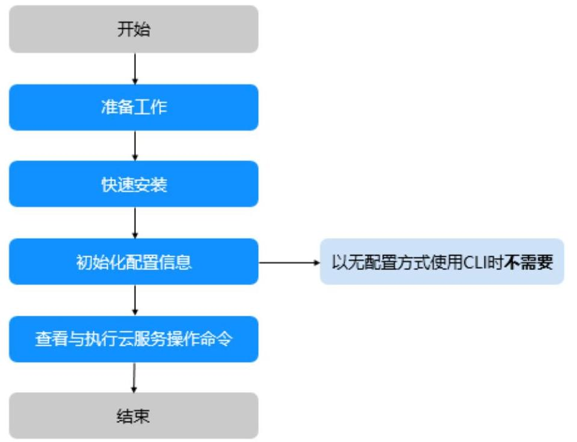

步骤1 注册华为账号，创建IAM用户并授权，获取访问密钥等，请参见步骤一:准备工作。

步骤2 使用KooCLI调用API Explorer中各云服务开放的API，管理和使用您的各类云服务资源前，需要先下载对应操作系统的KooCLI见步骤二:快速安装。

步骤3 使用KooCLI时，需要获取调用者的身份信息用以认证鉴权。如您不是以无配置方式使用，那么您需要先配置相关的认证信息，具体配置方法请参见步骤三:初始化配置。

步骤4 完成配置后，即可使用KooCLI管理和使用您的各类云服务资源，方法请参见步骤四: 查看与执行云服务操作命令。

---结束

在使用KooCLI前，您需要完成本文中的准备工作。

- 注册华为账号并完成实名认证

- 创建IAM用户并授权

- 获取访问密钥 ( AK/SK )

## 注册华为账号并完成实名认证

如果您已有一个华为账号，请跳到下一个任务。如果您还没有华为账号，请参考以下步骤创建。

步骤1 打开https://www.huaweicloud.com/，单击“注册”。

步骤2 根据提示信息完成注册，详细操作请参见如何注册华为账号。注册成功后，系统会自动跳转至您的个人信息界面。

步骤3 (可选)视具体云服务而定，若需要，请完成个人实名认证或企业实名认证。

---结束

## 创建 IAM 用户并授权

使用KooCLI管理和使用您的各类云服务资源时，需提供调用者(IAM用户)的身份信息用于认证鉴权。

IAM用户是由华为账号在IAM中创建的用户，是云服务的使用人员，具有独立的身份凭证，根据华为账号授予的权限使用资源，可以确保华为账号及资源的安全性。IAM用户不进行独立的计费，由所属华为账号统一付费。

您注册华为云后，系统自动创建华为账号对应的IAM用户，该用户在IAM中标识为“企业管理员”，其权限无法修改。出于业务需要，您可以另外创建IAM用户，并根据实际需要给IAM用户授权。

## 获取访问密钥(AK/SK)

使用KooCLI管理和使用您的各类云服务资源时，需提供调用者(IAM用户)的身份信息用于认证鉴权。为完成初始化配置，您可点此了解和获取访问密钥。

### 3.1 概述

- 针对不同的环境，您可以参考如下方式完成快速安装:

- 在Windows系统上安装KooCLI

- 在Linux系统上安装KooCLI

- 在MacOS系统上安装KooCLI

- 在Docker中配置和使用KooCLI

- 您也可以从下表中直接下载适配您目标系统的KooCLI到本地，再将其上传至您的目标机器，解压后即可使用:

表 3-1 下载地址

<table><tr><td>操作系统</td><td>下载地址</td><td>隐私声明</td></tr><tr><td>Windows 64位</td><td>KooCLI-windows-amd64.zip   KooCLI-windows-amd64.zip_sha256</td><td rowspan="5">详见《隐私政策声明》</td></tr><tr><td>Linux AMD 64 位</td><td>KooCLI-linux-amd64.tar.gz   KooCLI-linux-amd64.tar.gz_sha256</td></tr><tr><td>Linux ARM 64 位</td><td>KooCLI-linux-arm64.tar.gz   KooCLI-linux-arm64.tar.gz_sha256</td></tr><tr><td>macOS AMD 64位</td><td>KooCLI-mac-amd64.tar.gz   KooCLI-mac-amd64.tar.gz_sha256</td></tr><tr><td>macOS ARM 64位</td><td>KooCLI-mac-arm64.tar.gz   KooCLI-mac-arm64.tar.gz_sha256</td></tr></table>

---

☐ 说明

	KooCLI下载地址是不带sha256后缀结尾的链接，带sha256后缀结尾的下载链接仅为对应软

	件包的校验文件。

	例如:Windows 64位的下载链接是KooCLI-windows-amd64.zip，它的校验文件下载链

	接则是KooCLI-windows-amd64.zip_sha256。

---

### 3.2 在 Windows 系统上安装 KooCLI

步骤1 点此下载适配Windows系统的KooCLI。

步骤2 解压后得到hcloud.exe文件，如下图所示。

图 3-1 在 Windows 系统下载并解压后的 hcloud.exe 文件

此电脑 » 本地磁盘 (C:) » cli

步骤3 (可选)将KooCLI所在目录加入到系统环境变量Path中，方便在cmd窗口的任意目录下使用hcloud命令。

1. Windows 10 和 Windows 8 搜索并选择 “查看高级系统设置”，然后单击“环境变量”;

Windows 7 右键单击桌面上的 “计算机” 图标，从菜单中选择“属性”。单击 “高级系统设置”链接，然后单击“环境变量”。

2. 进入环境变量图形界面，在“用户变量”列表中，选中变量名为“Path”的环境变量，单击“编辑”。

3. 在编辑环境变量界面中单击“新建”，输入hcloud.exe文件所在目录的路径。

4. 单击三次“确定”，即可保存该修改。

5. (可选)打开cmd窗口，执行如下命令查看环境变量是否包含hcloud.exe文件所在目录，存在即说明配置成功。

set path

步骤4 (可选)打开Windows系统的cmd窗口(若您未执行如上步骤3，需要进入到工具所在的目录中)，输入并执行如下命令，验证KooCLI是否安装成功。

hcloud version

系统显示类似如下版本信息，表示安装成功:

hcloud version

当前KooCLI版本:3.2.8

---结束

### 3.3 在 Linux 系统上安装 KooCLI

KooCLI支持Linux AMD 64位 和 ARM 64位操作系统，您可以根据需要选择一键式安装或分步安装。分步安装时请根据您的操作系统选择相应的安装命令。执行如下命令可查看您主机的操作系统: echo \$HOSTTYPE

若执行如上命令的输出值是 “x86_64”，请使用AMD 64位系统的下载命令；若执行如上命令的输出值是 “aarch64”，请使用ARM 64位系统的下载命令。

## 一键式安装

请使用如下命令一键式安装KooCLI:

curl -sSL https://cn-north-4-hdn-koocli.obs.cn-north-4.myhuaweicloud.com/cli/latest/hcloud_install.sh -o ./ hcloud_install.sh && bash ./hcloud_install.sh

如上命令默认将KooCLI下载至“/usr/local/hcloud/”目录，并移动到“/usr/ local/bin/”目录下，方便在任意目录下使用hcloud命令(完成本步骤之前，请确保 PATH系统变量值中存在“/usr/local/bin/”路径)。

您可在该命令执行过程中根据交互信息修改文件下载目录等。如执行过程中提示权限不足，您可切换至root用户重新执行安装命令。

若您希望使用其默认配置且跳过交互模式，可在该命令末尾添加 "-y"，如下:

curl -sSL https://cn-north-4-hdn-koocli.obs.cn-north-4.myhuaweicloud.com/cli/latest/hcloud_install.sh -o ./ hcloud_install.sh && bash ./hcloud_install.sh -y

☐ 说明

hcloud_install.sh文件为一键式安装KooCLI的脚本文件，其对应的软件包校验文件为 hcloud_install.sh.sha256

## 分步安装

若您希望分步骤安装KooCLI，请参考以下步骤:

步骤1 请您使用以下命令之一下载KooCLI。

- 使用curl命令下载:

- AMD 64位操作系统下载命令:

curl -LO "https://cn-north-4-hdn-koocli.obs.cn-north-4.myhuaweicloud.com/cli/latest/ huaweicloud-cli-linux-amd64.tar.gz"

- ARM 64位操作系统下载命令:

curl -LO "https://cn-north-4-hdn-koocli.obs.cn-north-4.myhuaweicloud.com/cli/latest/ huaweicloud-cli-linux-arm64.tar.gz"

- 使用wget命令下载:

- AMD 64位操作系统下载命令:

wget "https://cn-north-4-hdn-koocli.obs.cn-north-4.myhuaweicloud.com/cli/latest/huaweicloud-cli-linux-amd64.tar.gz" -O huaweicloud-cli-linux-amd64.tar.gz

- ARM 64位操作系统下载命令:

wget "https://cn-north-4-hdn-koocli.obs.cn-north-4.myhuaweicloud.com/cli/latest/huaweicloud-cli-linux-arm64.tar.gz" -O huaweicloud-cli-linux-arm64.tar.gz

步骤2 解压工具包。

- AMD 64位操作系统解压命令:

tar -zxvf huaweicloud-cli-linux-amd64.tar.gz

- ARM 64位操作系统解压命令:

tar -zxvf huaweicloud-cli-linux-arm64.tar.gz

步骤3 (可选)将KooCLI移动到“/usr/local/bin/”目录下，方便在任意目录下使用hcloud命令(完成本步骤之前，请确保PATH系统变量值中存在“/usr/local/bin/”路径):

mv \$(pwd)/hcloud /usr/local/bin/

步骤4 (可选)执行如下命令，开启自动补全功能。

hcloud auto-complete on

系统显示如下信息表示自动补全功能开启成功。若该配置未生效请按提示执行 “bash”命令。

hcloud auto-complete on

开启成功!自动补全仅支持bash,若未生效请执行`bash`命令

步骤5 (可选)执行如下命令，验证是否安装成功。

hcloud version

系统显示类似如下版本信息，表示安装成功:

---

hcloud version

	当前KooCLI版本:3.2.8

---

---结束

### 3.4 在 MacOS 系统上安装 KooCLI

KooCLI支持MacOS AMD 64位 和 ARM 64位操作系统，您可以根据需要选择一键式安装或分步安装。分步安装时请根据您的操作系统选择相应的安装命令。执行如下命令查看您主机的操作系统:

echo \$HOSTTYPE

若执行如上命令的输出值是 “x86_64”，请使用AMD 64位系统的下载命令；若执行该命令输出结果为空，请使用如下命令查看您主机的操作系统:

uname -a

执行如上命令的输出值结尾是 “x86_64”，请使用AMD 64位系统的下载命令；若输出值结尾是“arm64”，请使用ARM 64位系统的下载命令。

## 一键式安装

请使用如下命令一键式安装KooCLI:

curl -sSL https://cn-north-4-hdn-koocli.obs.cn-north-4.myhuaweicloud.com/cli/latest/hcloud_install.sh -o ./ hcloud_install.sh && bash ./hcloud_install.sh

如上命令默认将KooCLI下载至“/usr/local/hcloud/”目录，并移动到“/usr/ local/bin/”目录下，方便在任意目录下使用hcloud命令(完成本步骤之前，请确保 PATH系统变量值中存在“/usr/local/bin/”路径)。

您可在该命令执行过程中根据交互信息修改文件下载目录等。如执行过程中提示权限不足，您可切换至root用户重新执行该安装命令。

若您希望使用其默认配置且跳过交互模式，可在该命令末尾添加 “-y”，如下:

---

curl -sSL https://cn-north-4-hdn-koocli.obs.cn-north-4.myhuaweicloud.com/cli/latest/hcloud_install.sh -o ./

	hcloud_install.sh && bash ./hcloud_install.sh -y

---

☐说明

---

	hcloud_install.sh文件为一键式安装KooCLI的脚本文件，其对应的软件包校验文件为

hcloud_install.sh.sha256

---

A 注意

命令执行过程中，如遇报错“sha256sum:command not found”，请安装 “sha256sum” 后再次执行命令。

## 分步安装

若您希望分步骤安装KooCLI，请参考以下步骤:

步骤1 请您使用以下命令之一下载KooCLI。

- 使用curl命令下载:

- AMD 64位操作系统下载命令:

curl -LO "https://cn-north-4-hdn-koocli.obs.cn-north-4.myhuaweicloud.com/cli/latest/ huaweicloud-cli-mac-amd64.tar.gz"

- ARM 64位操作系统下载命令:

curl -LO "https://cn-north-4-hdn-koocli.obs.cn-north-4.myhuaweicloud.com/cli/latest/ huaweicloud-cli-mac-arm64.tar.gz"

- 使用wget命令下载:

- AMD 64位操作系统下载命令:

wget "https://cn-north-4-hdn-koocli.obs.cn-north-4.myhuaweicloud.com/cli/latest/huaweicloud-cli-mac-amd64.tar.gz" -O huaweicloud-cli-mac-amd64.tar.gz

- ARM 64位操作系统下载命令:

wget "https://cn-north-4-hdn-koocli.obs.cn-north-4.myhuaweicloud.com/cli/latest/huaweicloud-cli-mac-arm64.tar.gz" -O huaweicloud-cli-mac-arm64.tar.gz

步骤2 解压缩工具包。

- AMD 64位操作系统解压命令:

tar -zxvf huaweicloud-cli-mac-amd64.tar.gz

- ARM 64位操作系统解压命令:

tar -zxvf huaweicloud-cli-mac-arm64.tar.gz

步骤3 (可选)将KooCLI移动到“/usr/local/bin/”目录下，方便在任意目录下使用hcloud命令(完成本步骤之前，请确保PATH系统变量值中存在“/usr/local/bin/”路径):

---

mv \$(pwd)/hcloud /usr/local/bin/

---

步骤4 (可选)执行如下命令，开启KooCLI自动补全功能。

hcloud auto-complete on

系统显示如下信息表示自动补全功能开启成功。若该配置未生效请按照提示执行 “bash”命令。

---

	hcloud auto-complete on

开启成功!自动补全仅支持bash,若未生效请执行`bash`命令

---

步骤5 (可选)执行如下命令，验证是否安装成功。

hcloud version

系统显示类似如下版本信息，表示安装成功:

hcloud version

当前KooCLI版本:3.2.8

---结束

### 3.5 在 Docker 中配置和使用 KooCLI

在Docker中配置和使用KooCLI，请遵循如下步骤(以创建Linux系统ubuntu发行版的 Docker容器为例):

在按步骤执行之前，请确保您已经安装Docker。有关安装说明，请参阅 Docker 网站。可运行以下命令确认是否安装Docker:

docker --version

[root@hdn /]# docker --version

Docker version 20.10.10, build b485636

步骤1 创建Dockerfile文件

新建目录并在该目录下创建名为Dockerfile的纯文本文件，文件内容如下:

FROM ubuntu:latest

RUN apt-get update -y && apt-get install curl -y

#一键式安装KooCLI

RUN curl -sSL https://cn-north-4-hdn-koocli.obs.cn-north-4.myhuaweicloud.com/cli/latest/hcloud_install.sh - o ./hcloud_install.sh && bash ./hcloud_install.sh -y

WORKDIR hcloud

☐ 说明

Dockerfile文件名带有大写字母D，且没有文件扩展名，每个目录只能保存一个。

hcloud_install.sh文件为一键式安装KooCLI的脚本文件，其对应的软件包校验文件为 hcloud_install.sh.sha256

可在上述Dockerfile文件中追加如下内容，指定启动容器时运行的程序为KooCLI:

---

ENTRYPOINT ["/usr/local/bin/hcloud"]

---

其后，以该文件构建的docker镜像所启动的容器仅支持执行单条KooCLI命令，详情见后文所示。

步骤2 构建镜像

在此目录下运行以下命令来构建名为 “hcloudcli” 的Docker镜像:

docker build --no-cache -t hcloudcli .

 d13c942271d6 Step 2/4 : RUN apt-get update -y && apt-get install curl -y ---> Running in 9749e0528633 Get:1 http://security.ubuntu.com/ubuntu focal-security InRelease [114 kB] Get:2 http://archive.ubuntu.com/ubuntu focal InRelease [265 kB] Get:3 http://security.ubuntu.com/ubuntu focal-security/restricted amd64 Packages [1937 kB] ... id install.sh -y ---> Running in 4043895a1ebd nSourceSoftwareNotice.md oving intermediate container 4043895alebd ---> 32024ffd054c Step 4/4 : WORKDIR hcloud ---> Running in 04b335bd41a0 emoving intermediate container 04b335bd41a0 -->

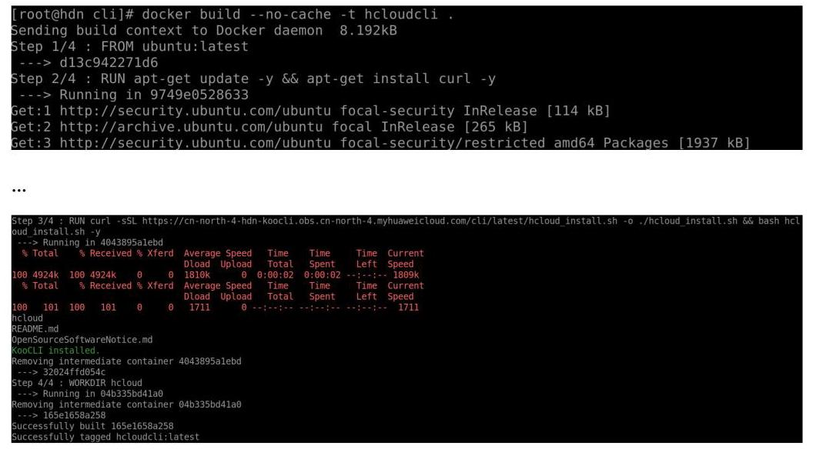

## ☐说明

命令末尾的“.”指在当前目录中构建Docker镜像，不可省略。

在Dockerfile文件中追加 “ENTRYPOINT ["/usr/local/bin/hcloud"]” 时，在构建镜像时会有如下提示:

 ca80e87bfc79 STEP 4/5 : WORKDIR hcloud ---> Running in 5fde725728aa emoving intermediate container 5fde725728aa Step 5/5 : ENTRYPOINT ["/usr/local/bin/hcloud"] --> Running in 34b33982e01c loving intermediate container 34b33982e01c -> a8eb3915d390 uccessfully built a8eb3915d390 Successfully tagged hcloudcli:latest -->

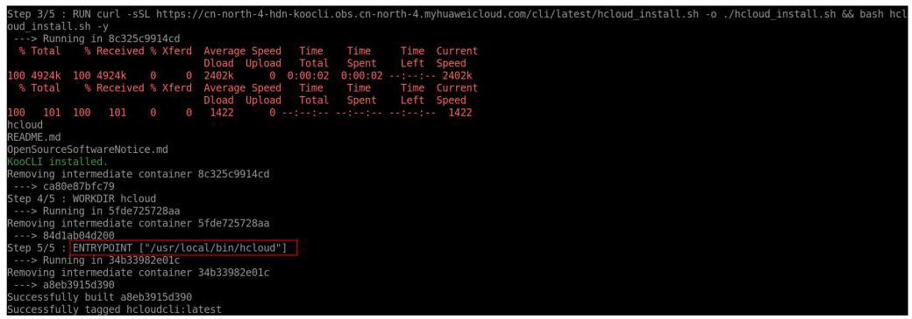

镜像构建成功后使用以下命令查看构建的镜像:

docker images

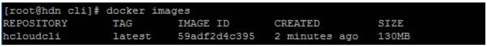

## 步骤3 使用镜像

- 用法一:基于“hcloudcli”镜像创建后台运行容器，并在容器中执行命令。

docker run -it -d -n -name hcloudcli hcloudcli

[root@hdn cli]# docker run -it -d --name hcloudcli hcloudcli

5afee3c20152245bfdc133a78f6b483cd9c57b5b4f0960ba96fd846bcf2876d6

运行如下命令查看已启动的Docker容器:

docker ps

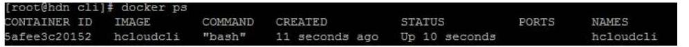

运行如下命令进入Docker容器，进入到容器后KooCLI的使用方式与直接在宿主机上使用相同:

docker exec -it hcloudcli /bin/bash

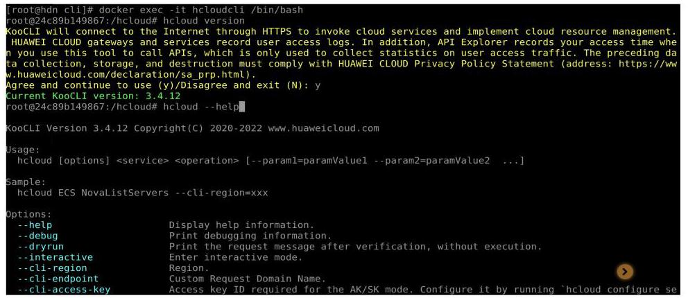

使用完成后，执行如下命令退出 “hcloudcli” 容器:

exit

要完全停止 “hcloudcli” 容器运行，可执行如下命令:

docker stop hcloudcli

- 用法二:基于“hcloudcli”镜像创建临时容器，并执行命令。

a. 创建临时容器，并执行命令:

docker run --rm -it hcloudcli \$\{command\}

- 使用未追加 “ENTRYPOINT ["/usr/local/bin/hcloud"]” 的Dockerfile创建的Docker镜像，在执行 “docker run” 命令时需指定运行的程序为 “hcloud”。如下所示:

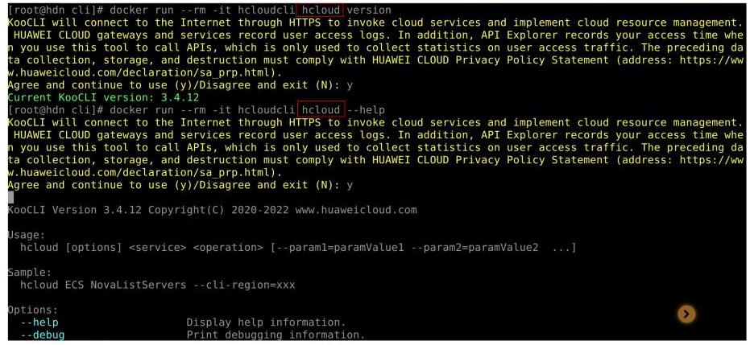

- 使用追加了 “ENTRYPOINT ["/usr/local/bin/hcloud"] ”的Dockerfile创建的Docker镜像，则不需要指定运行程序。此时 "docker run --rm -it hcloudcli”命令等效于在宿主机上直接执行“hcloud”命令。如下所示:

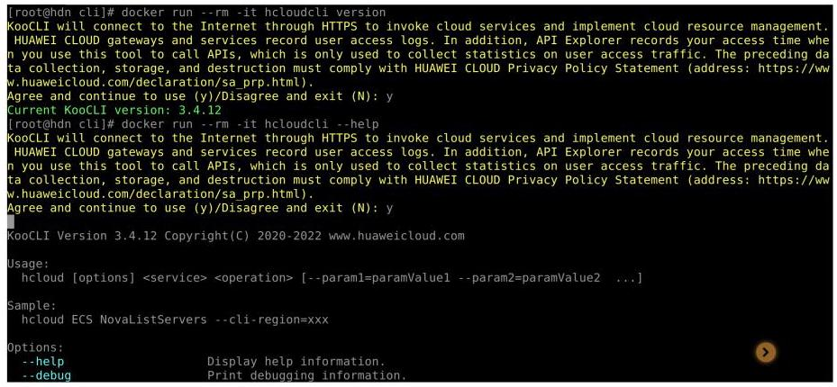

使用追加了 “ENTRYPOINT ["/usr/local/bin/hcloud"] ”的Dockerfile创建的 Docker镜像，执行“docker run”时仅支持KooCLI相关命令。

b. 创建临时容器，向容器共享宿主机文件(以Linux系统的宿主机为例)，并执行命令:

通过宿主机系统目录和容器目录的挂载，将宿主机文件共享到容器:

示例1:通过将宿主机系统的/root/.hcloud/目录挂载到容器的/root/.hcloud/ 目录下，将宿主机配置文件共享到容器:

---

docker run --rm -it -v /root/.hcloud/:/root/.hcloud/ hcloudcli \$\{command\}

---

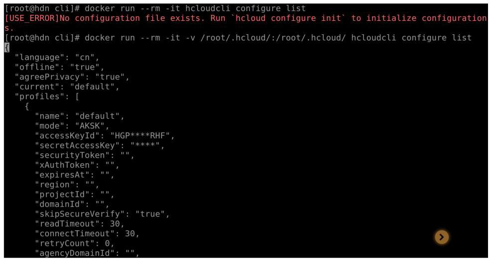

示例2:通过将宿主机系统的目录/cli挂载到容器的当前目录下，将宿主机该目录下的 “test.json” 文件共享到容器:

docker run --rm -it -v /root/.hcloud/:/root/.hcloud/ -v /cli:\\((pwd) hcloudcli$\{command\}

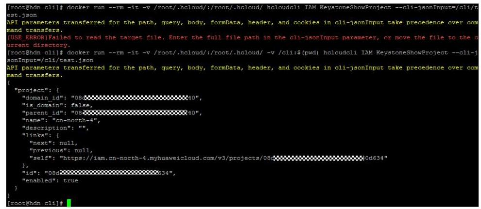

c. 创建临时容器，向容器共享宿主机环境变量(以Linux系统的宿主机为例)， 执行命令:

通过 “-e” 标志共享宿主机的环境变量到容器中:

docker run --rm -it -e \\(\{envName\} hcloudcli$\{command\}

## ☐说明

给命令起别名(以Linux系统的宿主机为例)，以简化命令。以使用追加了“ENTRYPOINT ["/usr/local/bin/hcloud"]”的Dockerfile创建的Docker镜像为例，执行如下命令，给原命令起别名为 “hcloud”:

alias hcloud='docker run --rm -it hcloudcli'

后续可使用别名执行原命令。如下所示:

XOOCLI will connect to the Internet through HTTPS to invoke cloud services and implement cloud resource management. HUAMEI CI

OUD gateways and services record user access logs. In addition, API Explorer records your access time when you use this tool

o call APIs, which is only used to collect statistics on user access traffic. The preceding data collection, storage, and defined in the process of the data.

truction must comply with HUAWEI CLOUD Privacy Policy Statement (address: https://www.huawei.cou/.com/declaration/sa.prp.htm

1).

Agree and continue to use (y)/Disagree and exit (N) : y

cache cleared.

root@hdn cli]#

## 步骤4 更新镜像

已构建的镜像，其中的KooCLI版本为镜像构建时的最新版本。若要保证镜像中使用最新版本，重新构建镜像即可。

## 步骤5 卸载镜像

执行如下命令卸载“hcloudcli”镜像:

docker rmi hcloudcli

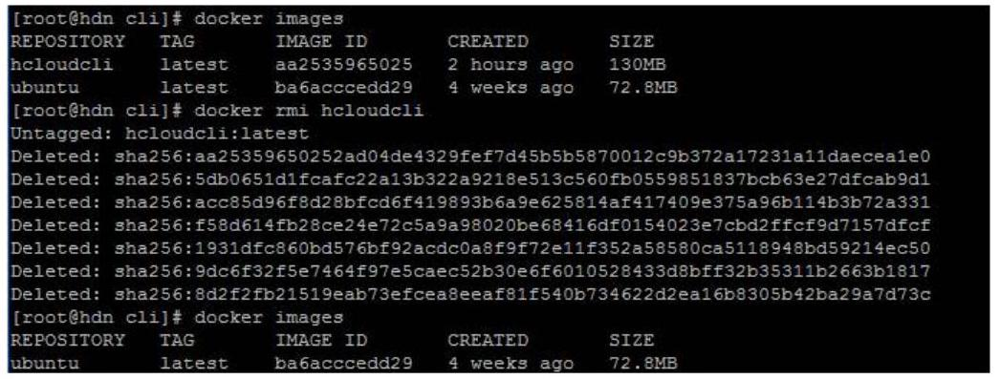

## ---结束

本节以Windows系统为例介绍KooCLI的使用，Linux和Mac系统的使用基本相同，可参考。

如果您希望以无配置方式使用KooCLI，可跳过此步骤；若您希望以非交互方式添加配置项，请参考新增或修改配置项。

KooCLI初始化命令用于将常用的永久AK/SK和区域信息存储在配置文件中，如下表所示，避免使用时频繁输入这些固定信息:

表 4-1 初始化时的参数

<table><tr><td>参数</td><td>说明</td></tr><tr><td>Access Key ID</td><td>访问密钥(永久AK/SK)中的访问密钥ID，简称AK，初始化时必填。</td></tr><tr><td>Secret Access Key</td><td>访问密钥(永久AK/SK)中的密码访问密钥，简称SK， 初始化时必填。</td></tr><tr><td>Region</td><td>区域，如cn-north-4，初始化时选填。</td></tr></table>

可通过如下命令进行初始化配置，输入命令后按回车进入交互模式，根据界面提示输入各参数值:

## hcloud configure init

hcloud configure init

开始初始化配置,其中"Secret Access Key"输入内容匿名化处理,获取参数可参考'https://

support.huaweicloud.com/usermanual-hcli/hcli_09.html'

Access Key ID [required]: ******

Secret Access Key [required]: ****

Secret Access Key (again): ***

Region: cn-north-4

*****************************************************

**** ****

初始化配置成功

**** ......

*****************************************************

☐ 说明

- 初始化过程中，“Second Access Key”的值需要二次确认。为保障您的账号安全，对您输入的“Secret Access Key”进行了匿名化处理。在您输入过程中不会显示输入的字符，在输入结束回车至下一行时，会以“*”回显您的输入内容。在配置完成后，KooCLI会在本地加密保存配置项中的认证相关的敏感信息。

- 如果重新执行初始化命令，则会在删除原配置文件后重新生成新的配置文件，配置文件保存地址如下:

- Windows系统:C:\\Users\\\{您的Windows系统用户名\\\\.hcloud\\config.json

- Linux系统: /home/\{当前用户名\}/.hcloud/config.json

- Mac系统:/Users/\{当前用户名\}/.hcloud/config.json

完成初始化后，可通过如下命令查询配置信息。KooCLI1.2.7以前的版本密文显示查询结果中的敏感信息；1.2.7及以后的版本匿名化显示查询结果中的敏感信息。

## hcloud configure show --cli-profile=default

---

hcloud configure show --cli-profile=default

\{

	"name": "default",

	"mode": "AKSK",

	"accessKeyld": "********,

	"secretAccessKey": "****",

	"securityToken": "",

	"region": "cn-north-4",

	"projectId": "",

	"domainId": "",

	"skipSecureVerify": "false",

	"readTimeout": 10,

	"connectTimeout": 5,

	"retryCount": 0

\}

---

## 步骤四:查看与执行云服务操作命令

本节以Windows系统为例介绍KooCLI的使用，Linux和Mac系统的使用基本相同，可参考。

完成初始化配置后，即可查询KooCLI支持的云服务列表，并执行相关命令。下文以弹性云服务器(ECS)的查询云服务器详情的API为例，说明如何查找与执行命令。

步骤1 查询云服务的operation列表

hcloud <service> --help

如下所示，"Available Operations" 中返回了ECS服务支持的operation列表。

---

hcloud ECS --help

KooCLI(Koo Command Line Interface) Version 3.2.8 Copyright(C) 2020-2023 www.huaweicloud.com

Usage:

hcloud ECS <operation> --param1=value1 --param2=value2 ...

Service:

ECS

Available Operations:

AddServerGroupMember MigrateServer 																									NovaShowServerAction

AssociateServerVirtualIp NovaAssociateSecurityGroup 																										NovaShowServerGroup

AttachServerVolume NovaAttachInterface 																									NovaShowServerInterface

	BatchAddServerNics NovaAttachVolume 																									NovaShowServerMetadata

---

## ☐ 说明

- 命令执行时，会使用您配置的认证信息执行请求，部分接口调用涉及云产品计费，请谨慎操作。

- 云服务支持的operation，也可在API Explorer界面查找。

- 可使用 “hcloud --help” 命令查询KooCLI支持的云服务列表。

步骤2 查询云服务具体operation的帮助信息

---

hcloud <service> <operation> --help

---

上一步查询得出ECS的operation列表，选取其中的 "NovaShowServer"，查询该API 的帮助信息。如下所示，返回信息列出API介绍、参数清单与说明。

---

hcloud ECS NovaShowServer --help

KooCLI(Koo Command Line Interface) Version 3.2.8 Copyright(C) 2020-2023 www.huaweicloud.com

Service:

										ECS

Description:

												根据云服务器ID，查询云服务器的详细信息。

Method:

												GET

	Params:

														--cli-region

																						required string 当前可调用的区域.若命令中未输入,将使用当前配置项中的cli-region

													--project_id

																						required string path 项目ID。若命令中未输入,将根据认证信息获取指定区域的父级项目ID,或使用当前配

	置项中的cli-project-id

													--server_id

																									required string path 云服务器ID。

													--OpenStack-API-Version

																								optional string header 微版本头。

---

步骤3 执行调用API的命令，获取执行结果。

---

## hcloud <service> <operation> [--param1=paramValue1 -- param2=paramValue2 ...]

---

如下所示，命令中输入cli-region(调用的区域)，project_id(项目ID)和server_id (云服务器ID)的参数值，按回车执行后，界面返回获取的云服务器信息。

---

hcloud ECS NovaShowServer --cli-region="cn-north-4" --project_id="0dd8cb"

server_id="4f06****-****-****-*****04dd856a"

\{

									"server": \{

															"tenant_id": "0dd8cb***************19b5a84546",

															"metadata": \{\},

																"addresses": \{

																					"c865***_******.****_*****efe7e8d8": [

																												\{

																																"OS-EXT-IPS-MAC:mac_addr": "fa:**********",

																																	"OS-EXT-IPS:type": "fixed",

																																		"addr": "192.****.***",

																																		"version": 4

																					\}

																	]

															\},

																"OS-EXT-STS:task_state": null,

															"OS-DCF:diskConfig": "AUTO",

															"OS-EXT-AZ:availability_zone": "cn-north-4g",

																"links": [

																			\{

																											"rel": "self",

																										"href": "https://ecs.cn-north-4.myhuaweicloud.com/v2.1/0dd8cb'

		***_******_****04dd856a"

																	\},

																			\{

																												"rel": "bookmark",

																												"href": "https://ecs.cn-north-4.myhuaweicloud.com/0dd8cb

		*****.*******04dd856a"

															\}

														],

																"OS-EXT-STS:power_state": 4,

															"id": "4f06***.****_*****_*****04dd856a",

															"os-extended-volumes:volumes_attached": [

																			\{

																										"id": "aed9******_*****_******0e3219cf"

																	\}

													],

															"OS-EXT-SRV-ATTR:host": "51f41ce46'

														"image": \{

---

---

	"links": [

		"rel": "bookmark",

		"href": "https://ecs.cn-north-4.myhuaweicloud.com/0dd8cb

*****.*********38539e09"

	\}

	],

	"id": "67f4******....******....******36539e09"

	\},

	"OS-SRV-USG:terminated_at": null,

	"accessIPv4": "",

	"accessIPv6": "",

	"created": "2022-05-10T12:56:36Z",

	"hostId": "51f41ce46************************************38b69b7aa4ea2a8",

	"OS-EXT-SRV-ATTR:hypervisor_hostname": "cf199aabae*******************************bed586126e6f57",

	"flavor": \{

	"links": [

		\{

		"rel": "bookmark",

		"href": "https://ecs.cn-north-4.myhuaweicloud.com/0dd8cb************19b5a84546/flavors/

s6.medium.2"

	\}

	],

	"id": "s6.medium.2"

	\},

	"key_name": null,

	"security_groups": [

	\{

		"name": "Sys-*********"

	\}

	],

	"OS-EXT-STS:vm_state": "stopped",

	"user_id": "b4d561***************346deaf79e",

	"OS-EXT-SRV-ATTR:instance_name": "instance-******",

	"name": "ecs-****",

	"OS-SRV-USG:launched_at": "2022-05-10T12:56:53.000000",

	"updated": "2022-05-13T08:05:17Z",

	"status": "SHUTOFF"

\}

\}

---

## ☐说明

- 使用KooCLI调用API时，您可以在API Explorer上获取CLI示例。

- KooCLI可在API调用过程中根据用户认证信息自动获取IAM用户所属账号ID、项目ID，同时若配置信息中已配置cli-region值，命令中可不输入。

- 如果命令中参数值不正确，将会返回报错信息。如下所示:

hcloud ECS ShowServer --project_id="0dd8cb*************19b5a84546" --cli-region="cn-north-4" --

---

server_id="abc"

\{

																				"error": \{

																											"message": "Instance[abc] could not be found.",

																											"code": "Ecs.0114"

							\}

	\}

		错误详情参见错误中心'https://console.huaweicloud.com/apiexplorer/#/errorcenter?

	keyword=Ecs.0114&product=ECS'

---

----结束

KooCLI目前支持在配置项中以如下组合方式配置认证参数:访问密钥(永久AK/ SK)，临时安全凭证(临时AK/SK和SecurityToken)两种。

其中，临时安全凭证(临时AK/SK和SecurityToken)具有时效性。

初始化配置信息时，配置项的名称为 “default”，且初始化时配置项中只允许配置永久AK/SK。如果您要使用其他认证方式，或修改初始化的配置项中的参数值，可使用 "hcloudconfigure set --cli-profile=default --key1=value1..." 命令，详情请参考新增或修改配置项。